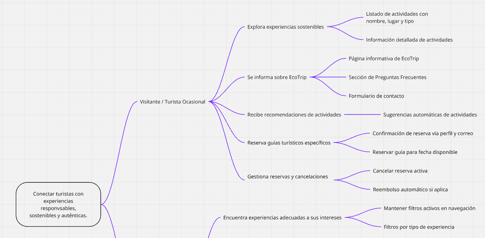
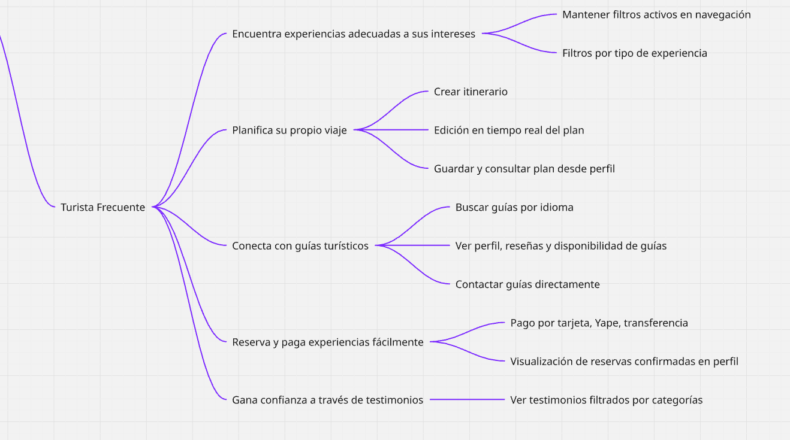
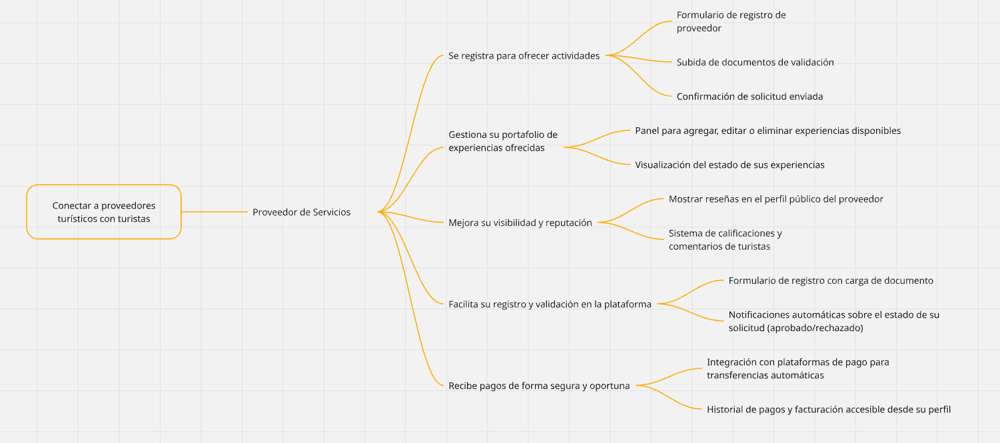

# report

### Universidad Peruana de ciencias Aplicadas 

### Ingeniería de Software

### 2025-01

### Código del Curso   y Nombre del curso

### 4374 - Aplicaciones Web
### Nombre del profesor
### "Informe de Trabajo Final"
### Nombre del startup 
### Nombre del producto 
### Relación de integrantes (Incluyendo en cada caso Código, Apellidos y Nombres) 
### Mes y año 
---------------------------------------------------------------------------------------------------------------------------
### Tabla de contenidos
### Student Outcome

### Capítulo I: Introducción 

1.1. Startup Profile

1.1.1. Descripción de la Startup

1.1.2. Perfiles de integrantes del equipo

1.2. Solution Profile

1.2.1 Antecedentes y problemática

1.2.2 Lean UX Process.

1.2.2.1. Lean UX Problem Statements.

1.2.2.2. Lean UX Assumptions.

1.2.2.3. Lean UX Hypothesis Statements.

1.2.2.4. Lean UX Canvas.

1.3. Segmentos objetivo.

### Capítulo II: Requirements Elicitation & Analysis

2.1. Competidores.

2.1.1. Análisis competitivo.

2.1.2. Estrategias y tácticas frente a competidores.

2.2. Entrevistas.

2.2.1. Diseño de entrevistas.

2.2.2. Registro de entrevistas.

2.2.3. Análisis de entrevistas.

2.3. Needfinding.

2.3.1. User Personas.

2.3.2. User Task Matrix.

2.3.3. User Journey Mapping.

2.3.4. Empathy Mapping.

2.3.5. As-is Scenario Mapping.

2.4. Ubiquitous Language.

### Capítulo III: Requirements Specification

3.1. To-Be Scenario Mapping.

3.2. User Stories.

3.3. Impact Mapping.

#### Mapa de segmento turistas responsable:

#### Mapa de segmento proveedores turisticos ecologicos:

3.4. Product Backlog.

|ID | Título | Prioridad | Descripción|
|--------------|--------------|--------------|--------------|
|US-01 | Ver lista de experiencias sostenibles | Alta | Como turista ocasional quiero ver una lista de experiencias para explorar qué ofrece EcoTrip.|
|US-01.1 | Filtrar experiencias por tipo | Alta | Como turista frecuente quiero filtrar experiencias por tipo para encontrar lo que me interesa.|
|US-02 | Registro de proveedores | Alta | Como proveedor quiero registrarme para ofrecer mis servicios turísticos sostenibles.|
|US-02.1 | Aprobación de proveedor | Alta | Como administrador quiero revisar y aprobar solicitudes de proveedores.|
|US-03 | Crear plan de viaje personalizado | Media | Como turista frecuente quiero armar mi propio itinerario con actividades y hospedajes.|
|US-03.1 | Sugerencias de itinerario basadas en intereses | Media | Como turista ocasional quiero recibir sugerencias de actividades según mi perfil.|
|US-04 | Conexión con guías turísticos | Alta | Como turista frecuente quiero contactar guías que hablen mi idioma.|
|US-04.1 | Reservar guía específico | Media | Como turista ocasional quiero poder reservar a un guía en específico.|
|US-05 | Reservar y pagar experiencias | Alta | Como turista frecuente quiero reservar y pagar actividades de manera fácil.|
|US-05.1 | Cancelar reserva y recibir reembolso | Media | Como turista ocasional quiero cancelar mi reserva si no podré asistir.|
|US-06 | Página informativa sobre EcoTrip | Media | Como visitante quiero saber qué es EcoTrip y qué servicios ofrece.|
|US-06.1 | Ver testimonios de otros viajeros | Baja | Como visitante quiero leer opiniones para confiar en la plataforma.|
|US-07 | Gestión del portafolio de proveedores | Alta | Como proveedor quiero agregar, editar o eliminar mis experiencias.|
|US-08 | Mejorar visibilidad de proveedores | Media | Como proveedor quiero mostrar mis calificaciones y reseñas públicas.|
|US-09 | Registro y validación fácil para proveedores | Alta | Como proveedor quiero un proceso de registro rápido y sencillo.|
|US-10 | Recibir pagos seguros como proveedor | Alta | Como proveedor quiero recibir mis pagos de manera segura y poder ver mi historial.|

### Capítulo IV: Product Design

4.1. Style Guidelines.

4.1.1. General Style Guidelines.

4.1.2. Web Style Guidelines.

4.2. Information Architecture.

4.2.1. Organization Systems.

4.2.2. Labeling Systems.

4.2.3. SEO Tags and Meta Tags

4.2.4. Searching Systems.

4.2.5. Navigation Systems.

4.3. Landing Page UI Design.

4.3.1. Landing Page Wireframe.

4.3.2. Landing Page Mock-up.

4.4. Web Applications UX/UI Design.

4.4.1. Web Applications Wireframes.

4.4.2. Web Applications Wireflow Diagrams.

4.4.2. Web Applications Mock-ups.

4.4.3. Web Applications User Flow Diagrams.

4.5. Web Applications Prototyping.

4.6. Domain-Driven Software Architecture.

4.6.1. Software Architecture Context Diagram.

4.6.2. Software Architecture Container Diagrams.

4.6.3. Software Architecture Components Diagrams.

4.7. Software Object-Oriented Design.

4.7.1. Class Diagrams.

4.7.2. Class Dictionary.

4.8. Database Design.

4.8.1. Database Diagram.

### Capítulo V: Product Implementation, Validation & Deployment

5.1. Software Configuration Management.

5.1.1. Software Development Environment Configuration.

5.1.2. Source Code Management.

5.1.3. Source Code Style Guide & Conventions.

5.1.4. Software Deployment Configuration.

5.2. Landing Page, Services & Applications Implementation.

5.2.X. Sprint n

5.2.X.1. Sprint Planning n.

5.2.X.2. Aspect Leaders and Collaborators.

5.2.X.3. Sprint Backlog n.

5.2.X.4. Development Evidence for Sprint Review.

5.2.X.5. Execution Evidence for Sprint Review.

5.2.X.6. Services Documentation Evidence for Sprint Review.

5.2.X.7. Software Deployment Evidence for Sprint Review.

5.2.X.8. Team Collaboration Insights during Sprint.

5.3. Validation Interviews.

5.3.1. Diseño de Entrevistas.

5.3.2. Registro de Entrevistas.

5.3.3. Evaluaciones según heurísticas.

5.4. Video About-the-Product.

### Conclusiones
### Conclusiones y recomendaciones.
### Video About-the-Team.
