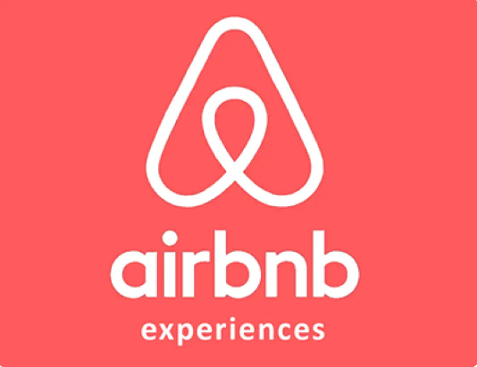
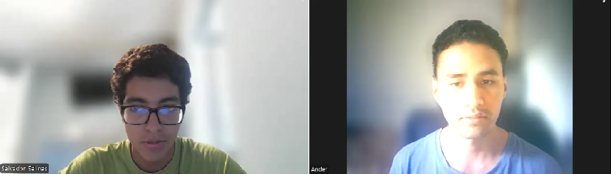
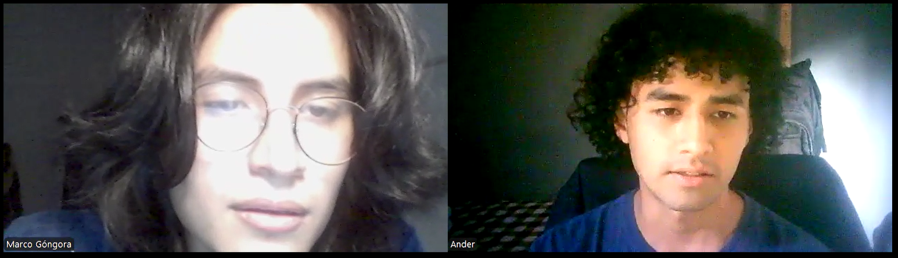
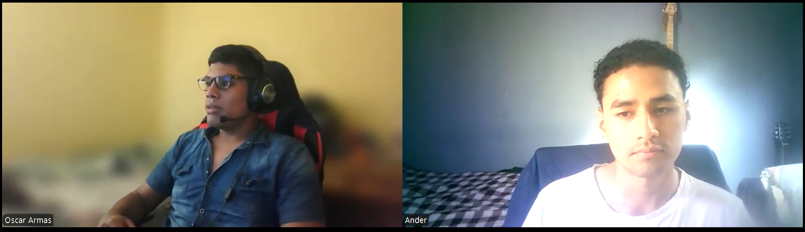
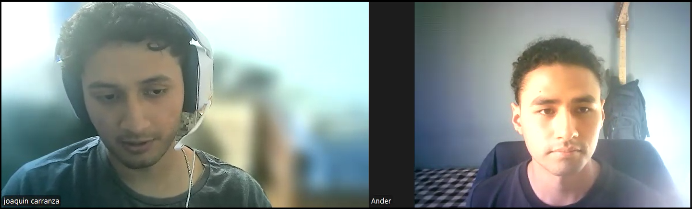
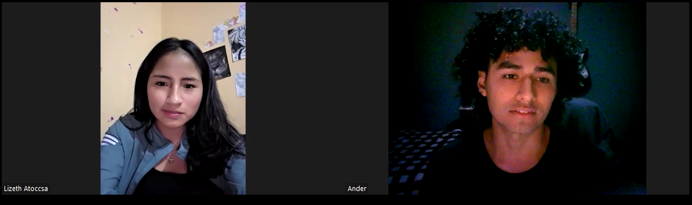
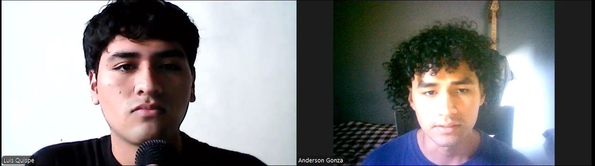

# report

### Universidad Peruana de ciencias Aplicadas

### Ingeniería de Software

### 2025-01

### Código del Curso   y Nombre del curso

### 4374 - Aplicaciones Web

### Nombre del profesor

### "Informe de Trabajo Final"

### Nombre del startup 

### Nombre del producto 

### Relación de integrantes (Incluyendo en cada caso Código, Apellidos y Nombres) 

### Mes y año 

---

### Tabla de contenidos

### Student Outcome

### Capítulo I: Introducción 

1.1. Startup Profile

1.1.1. Descripción de la Startup

1.1.2. Perfiles de integrantes del equipo

1.2. Solution Profile

1.2.1 Antecedentes y problemática

1.2.2 Lean UX Process.

1.2.2.1. Lean UX Problem Statements.

1.2.2.2. Lean UX Assumptions.

1.2.2.3. Lean UX Hypothesis Statements.

1.2.2.4. Lean UX Canvas.

1.3. Segmentos objetivo.

### Capítulo II: Requirements Elicitation & Analysis

2.1. Competidores.

2.1.1. Análisis competitivo.

2.1.2. Estrategias y tácticas frente a competidores.

2.2. Entrevistas.

2.2.1. Diseño de entrevistas.

2.2.2. Registro de entrevistas.

2.2.3. Análisis de entrevistas.

2.3. Needfinding.

2.3.1. User Personas.

2.3.2. User Task Matrix.

2.3.3. User Journey Mapping.

2.3.4. Empathy Mapping.

2.3.5. As-is Scenario Mapping.

2.4. Ubiquitous Language.

### Capítulo III: Requirements Specification

3.1. To-Be Scenario Mapping.

3.2. User Stories.

3.3. Impact Mapping.

3.4. Product Backlog.

### Capítulo IV: Product Design

4.1. Style Guidelines.

4.1.1. General Style Guidelines.

4.1.2. Web Style Guidelines.

4.2. Information Architecture.

4.2.1. Organization Systems.

4.2.2. Labeling Systems.

4.2.3. SEO Tags and Meta Tags

4.2.4. Searching Systems.

4.2.5. Navigation Systems.

4.3. Landing Page UI Design.

4.3.1. Landing Page Wireframe.

4.3.2. Landing Page Mock-up.

4.4. Web Applications UX/UI Design.

4.4.1. Web Applications Wireframes.

4.4.2. Web Applications Wireflow Diagrams.

4.4.2. Web Applications Mock-ups.

4.4.3. Web Applications User Flow Diagrams.

4.5. Web Applications Prototyping.

4.6. Domain-Driven Software Architecture.

4.6.1. Software Architecture Context Diagram.

4.6.2. Software Architecture Container Diagrams.

4.6.3. Software Architecture Components Diagrams.

4.7. Software Object-Oriented Design.

4.7.1. Class Diagrams.

4.7.2. Class Dictionary.

4.8. Database Design.

4.8.1. Database Diagram.

### Capítulo V: Product Implementation, Validation & Deployment

5.1. Software Configuration Management.

5.1.1. Software Development Environment Configuration.

5.1.2. Source Code Management.

5.1.3. Source Code Style Guide & Conventions.

5.1.4. Software Deployment Configuration.

5.2. Landing Page, Services & Applications Implementation.

5.2.X. Sprint n

5.2.X.1. Sprint Planning n.

5.2.X.2. Aspect Leaders and Collaborators.

5.2.X.3. Sprint Backlog n.

5.2.X.4. Development Evidence for Sprint Review.

5.2.X.5. Execution Evidence for Sprint Review.

5.2.X.6. Services Documentation Evidence for Sprint Review.

5.2.X.7. Software Deployment Evidence for Sprint Review.

5.2.X.8. Team Collaboration Insights during Sprint.

5.3. Validation Interviews.

5.3.1. Diseño de Entrevistas.

5.3.2. Registro de Entrevistas.

5.3.3. Evaluaciones según heurísticas.

5.4. Video About-the-Product.

### Conclusiones

### Conclusiones y recomendaciones.

### Video About-the-Team.

# Capitulo II Requirements Elicitation & Analysis

## 2.1 Competidores

- **Airbnb Experiences**: Es una plataforma de Airbnb que ofrece actividades únicas y auténticas diseñadas y guiadas por locales en diversas ciudades alrededor del mundo. A diferencia de los alojamientos tradicionales de Airbnb, las Experiencias se centran en vivir momentos memorables, aprender nuevas habilidades o descubrir la cultura local desde una perspectiva diferente.

  

- **GetYourGuide**: Es una plataforma global de reservas en línea especializada en experiencias turísticas, tours y actividades en destinos de todo el mundo. Funciona como un mercado digital donde los viajeros pueden descubrir y reservar excursiones, visitas guiadas, entradas a atracciones y actividades únicas con proveedores locales.

  

- **Visit.org**: Visit.org es una plataforma global de reservas de experiencias de viaje con impacto social, que conecta a viajeros con tours y actividades operados por organizaciones sin fines de lucro (ONGs) y empresas sociales alrededor del mundo. Su objetivo es promover un turismo sostenible y responsable, donde el dinero gastado en experiencias beneficie directamente a comunidades locales y causas sociales.

  

### 2.1.1. Análisis competitivo

<table>
  <tr>
    <th colspan="6" valign="top">Competitive Analysis Landscape</th>
  </tr>
  <tr>
    <td colspan="2" valign="top">¿Por qué llevar a cabo este análisis?</td>
    <td colspan="4" valign="top">El objetivo de este análisis es identificar las características de los competidores y encontrar maneras de diferenciarnos.</td>
  </tr>
  <tr>
    <td colspan="2" rowspan="2" valign="top">Startup y Competidores</td>
    <td valign="top">EcoTrip</td>
    <td valign="top">Airbnb Experiences</td>
    <td valign="top">GetYourGuide</td>
    <td valign="top">Visit.org</td>
  </tr>
  <tr>
    <td valign="top"></td>
    <td valign="top"></td>
    <td valign="top"></td>
    <td valign="top"></td>
  </tr>
  <tr>
    <td rowspan="2" valign="top">Perfil</td>
    <td valign="top">Overview</td>
    <td valign="top">Plataforma que conecta viajeros con experiencias sostenibles, auténticas y responsables, priorizando el impacto ambiental y comunitario.</td>
    <td valign="top">Plataforma de Airbnb para experiencias guiadas por locales (culturales, gastronómicas, etc.).</td>
    <td valign="top">Plataforma global para reservar tours y actividades guiadas.</td>
    <td valign="top">Plataforma que ofrece actividades con impacto social y ambiental junto a ONGs y empresas sociales.</td>
  </tr>
  <tr>
    <td valign="top">Ventaja competitiva ¿Qué valor ofrece a los clientes?</td>
    <td valign="top">Diseño de experiencias sostenibles, conexión con comunidades indígenas, guías multilingües, impacto positivo medible.</td>
    <td valign="top">Fuerte comunidad de anfitriones y viajeros; integración con su app de alojamiento.</td>
    <td valign="top">Gran cobertura y variedad de actividades urbanas en múltiples idiomas.</td>
    <td valign="top">Enfoque exclusivo en impacto social con ONGs verificadas.</td>
  </tr>
  <tr>
    <td rowspan="2" valign="top">Perfil de Marketing</td>
    <td valign="top">Mercado objetivo</td>
    <td valign="top">Turistas responsables, viajeros eco-conscientes y proveedores turísticos sostenibles.</td>
    <td valign="top">Millennials, turistas urbanos, viajeros espontáneos.</td>
    <td valign="top">Turistas internacionales y locales que buscan tours estructurados.</td>
    <td valign="top">Empresas que quieren promover el turismo con impacto social.</td>
  </tr>
  <tr>
    <td valign="top">Estrategias de marketing</td>
    <td valign="top">Alianzas con ONGs, influencers sostenibles, campañas educativas.</td>
    <td valign="top">Marketing por redes sociales, publicidad en la app, boca a boca.</td>
    <td valign="top">SEO, anuncios pagados, campañas de video marketing.</td>
    <td valign="top">Alianzas B2B con ONGs y empresas.</td>
  </tr>
  <tr>
    <td rowspan="3" valign="top">Perfil de Producto</td>
    <td valign="top">Productos & Servicios</td>
    <td valign="top">Experiencias, voluntariados, guías locales, itinerarios inteligentes.</td>
    <td valign="top">Experiencias locales, clases, tours y talleres.</td>
    <td valign="top">Tours, tickets a atracciones, visitas guiadas.</td>
    <td valign="top">Actividades solidarias y de impacto (voluntariado, talleres).</td>
  </tr>
  <tr>
    <td valign="top">Precios & Costos</td>
    <td valign="top">Comisión por reserva (transparente), servicios premium opcionales.</td>
    <td valign="top">Comisión en cada experiencia + tarifa del anfitrión.</td>
    <td valign="top">Comisión y precios fijos por actividad.</td>
    <td valign="top">Costos varían según la ONG; comisión para Visit.org.</td>
  </tr>
  <tr>
    <td valign="top">Canales de distribución (Web y/o Móvil)</td>
    <td valign="top">Web y/o móvil</td>
    <td valign="top">Web y App móvil</td>
    <td valign="top">Web y App móvil</td>
    <td valign="top">Web (limitado en app)</td>
  </tr>
  <tr>
    <td rowspan="4" valign="top">Análisis SWOT</td>
    <td valign="top">Fortalezas</td>
    <td valign="top">Enfoque ecológico y social, propuesta diferenciada, nicho emergente.</td>
    <td valign="top">Marca reconocida, red global, integración con hospedajes.</td>
    <td valign="top">Amplia oferta, multilenguaje, presencia global.</td>
    <td valign="top">Alta credibilidad social, alianza con ONGs, impacto real.</td>
  </tr>
  <tr>
    <td valign="top">Debilidades</td>
    <td valign="top">Plataforma nueva, baja visibilidad, dependencia de terceros.</td>
    <td valign="top">Algunas experiencias no verificadas, saturación de oferta.</td>
    <td valign="top">Falta de personalización, enfoque más comercial.</td>
    <td valign="top">Oferta limitada geográficamente, poca variedad.</td>
  </tr>
  <tr>
    <td valign="top">Oportunidades</td>
    <td valign="top">Creciente interés por el ecoturismo, apoyo a lo local, viajeros conscientes.</td>
    <td valign="top">Expansión de experiencias virtuales.</td>
    <td valign="top">Crecimiento del turismo.</td>
    <td valign="top">Aumento del interés por turismo con propósito.</td>
  </tr>
  <tr>
    <td valign="top">Amenazas</td>
    <td valign="top">Competencia consolidada, regulación turística, baja adopción tecnológica local.</td>
    <td valign="top">Legislación local, críticas por experiencias no auténticas.</td>
    <td valign="top">Competencia con Airbnb y nuevas plataformas.</td>
    <td valign="top">Bajo conocimiento de marca en algunos países.</td>
  </tr>
</table>

### 2.1.2. Estrategias y tácticas frente a competidores

Las estrategias de EcoTrip frente a sus competidores son:

- Evaluación sostenible verificada: A diferencia de Airbnb o Lokafy, todas las experiencias en EcoTrip pasarán por una validación basada en criterios ambientales, sociales y culturales.

- Asistencia personalizada con itinerarios inteligentes: Una herramienta gratuita para armar viajes a medida y un servicio premium para optimizar experiencias según presupuesto, tiempo e impacto.

- Servicio multilingüe y culturalmente contextualizado: Conexión entre turistas y guías que no solo hablen su idioma, sino que comprendan sus referencias culturales.

- Modelo inclusivo para proveedores pequeños: Plan freemium para que guías y comunidades puedan tener presencia en la plataforma sin costo inicial.

## 2.2. Entrevistas

### 2.2.1. Diseño de entrevistas

**Turistas Responsables**

- ¿Qué te motiva a viajar?
  (Explora si buscan aventura, relajación, conexión cultural, etc.)

- ¿Has participado antes en actividades de turismo sostenible o comunitario? ¿Cómo fue tu experiencia?

- ¿Qué factores tomas en cuenta al elegir un destino o experiencia turística?

- ¿Qué tan importante es para ti el impacto ambiental y social del lugar o actividad que visitas?

- ¿Qué canales usas normalmente para planear o reservar tus viajes? (Webs, apps, redes sociales, agencias, etc.)

- ¿Cuáles han sido tus principales frustraciones al buscar experiencias de viaje más auténticas o sostenibles?

- ¿Qué dispositivos usas normalmente para organizar tus viajes? (Laptop, smartphone, tablet)

**Proveedores Sostenibles**

- ¿Cómo describirías los servicios o experiencias que ofreces a los turistas?

- ¿Qué te motivó a ofrecer experiencias turísticas sostenibles o comunitarias?

- ¿Cuáles son tus principales desafíos para atraer y conectar con turistas?

- ¿Qué medios usas actualmente para promocionar tus servicios? ¿Con qué frecuencia los usas?

- ¿Qué tipo de turistas suelen visitarte? ¿Qué valoran más de lo que ofreces?

- ¿Has tenido alguna experiencia con plataformas digitales de turismo? ¿Cómo fue?

- ¿Qué mejoras te gustaría ver en la forma de promocionar y gestionar tus experiencias?

### 2.2.2. Registro de entrevistas

#### Entrevista 1 - Cliente

**Entrevistador:** Anderson Gonza

**Entrevistado:** Salvador Salinas

Edad: 23 años

Ocupación: Programador freelance

Residencia: Lima, Perú

**Link de la entrevista:** https://upcedupe-my.sharepoint.com/:v:/g/personal/u202120836_upc_edu_pe/EdIFRKsWsE5NkDlJaW2rn24BLqDtL3K0gaUY9ADINi2FhQ?nav=eyJyZWZlcnJhbEluZm8iOnsicmVmZXJyYWxBcHAiOiJPbmVEcml2ZUZvckJ1c2luZXNzIiwicmVmZXJyYWxBcHBQbGF0Zm9ybSI6IldlYiIsInJlZmVycmFsTW9kZSI6InZpZXciLCJyZWZlcnJhbFZpZXciOiJNeUZpbGVzTGlua0NvcHkifX0&e=Fkm3lW

  

#### Resumen de la entrevista

Salvador es un programador freelance que viaja solo con mochila, buscando autenticidad y mínimo impacto ambiental. Ha hecho voluntariados de reforestación y organiza sus viajes desde su smartphone usando Instagram y blogs. Le frustra no encontrar fácilmente experiencias verdaderamente auténticas.

#### Entrevista 2 - Cliente

**Entrevistador:** Anderson Gonza

**Entrevistado:** Marcos

Edad: 20 años

Ocupación: Estudiante de Ingeniería Ambiental

Residencia: Lima, Perú

**Link de la entrevista:** https://upcedupe-my.sharepoint.com/:v:/g/personal/u202120836_upc_edu_pe/Ecn81ZUtC0lIkv0iftk907QBCUFv5cW5h4287FDTk1YFZg?nav=eyJyZWZlcnJhbEluZm8iOnsicmVmZXJyYWxBcHAiOiJPbmVEcml2ZUZvckJ1c2luZXNzIiwicmVmZXJyYWxBcHBQbGF0Zm9ybSI6IldlYiIsInJlZmVycmFsTW9kZSI6InZpZXciLCJyZWZlcnJhbFZpZXciOiJNeUZpbGVzTGlua0NvcHkifX0&e=rXdblg

  

#### Resumen de la entrevista

Marcos estudia ingeniería ambiental y viaja para aprender y colaborar directamente en conservación. Ha trabajado en rescates de animales en la selva y busca proyectos donde pueda involucrarse de verdad. Le molesta la falta de transparencia sobre el impacto real de muchas experiencias turísticas.

#### Entrevista 3 - Cliente

**Entrevistador:** Anderson Gonza

**Entrevistado:** Oscar

Edad: 22 años

Ocupación: Estudiante de Administración de Empresas

Residencia: Lima, Perú

**Link de la entrevista:** https://upcedupe-my.sharepoint.com/:v:/g/personal/u202120836_upc_edu_pe/EeFNDUDzBBxHk-pqT2t1R4kBIZztjxTs9ATdjn360LJ90g?nav=eyJyZWZlcnJhbEluZm8iOnsicmVmZXJyYWxBcHAiOiJPbmVEcml2ZUZvckJ1c2luZXNzIiwicmVmZXJyYWxBcHBQbGF0Zm9ybSI6IldlYiIsInJlZmVycmFsTW9kZSI6InZpZXciLCJyZWZlcnJhbFZpZXciOiJNeUZpbGVzTGlua0NvcHkifX0&e=yI1daS

  

#### Resumen de la entrevista

Oscar, estudiante de administración, viaja con amigos para desconectarse de la rutina. Le gustan los destinos únicos y económicos, y aunque antes no pensaba en el impacto social o ambiental, ahora sí lo valora. Se inspira en TikTok e Instagram, pero le cuesta confiar en que las experiencias sean realmente sostenibles.

#### Entrevista 4 - Provedor

**Entrevistador:** Anderson Gonza

**Entrevistado:** Joaquin

Edad: 27 años

Rol: Propietario de un ecohostal en Oxapampa

Tipo: Emprendimiento ecológico privado

**Link de la entrevista:** https://upcedupe-my.sharepoint.com/:v:/g/personal/u202120836_upc_edu_pe/EVwxh00o199Mt8Xyh5limHABwAnrKvxi8nO9BWHetalSrA?nav=eyJyZWZlcnJhbEluZm8iOnsicmVmZXJyYWxBcHAiOiJPbmVEcml2ZUZvckJ1c2luZXNzIiwicmVmZXJyYWxBcHBQbGF0Zm9ybSI6IldlYiIsInJlZmVycmFsTW9kZSI6InZpZXciLCJyZWZlcnJhbFZpZXciOiJNeUZpbGVzTGlua0NvcHkifX0&e=Oa3bhT

  

#### Resumen de la entrevista

Joaquín dirige un ecohostal en Oxapampa donde mezcla naturaleza, gastronomía local y rutas poco conocidas. Aunque Airbnb e Instagram lo ayudan a atraer turistas, le gustaría menos dependencia de plataformas y más apoyo para destacar su propuesta ecológica auténtica.

#### Entrevista 5 - Provedor

**Entrevistador:** Anderson Gonza

**Entrevistado:** Lizeth

Edad: 26 años

Rol: Coordinadora de programas de conservación en una ONG ambiental en Tarapoto.

Tipo: Organización sin fines de lucro

**Link de la entrevista:** https://upcedupe-my.sharepoint.com/:v:/g/personal/u202120836_upc_edu_pe/EUwfonQnWXVLoY9hKMP6mxMBNzYCQ68ym8faLh5DOd50xA?nav=eyJyZWZlcnJhbEluZm8iOnsicmVmZXJyYWxBcHAiOiJPbmVEcml2ZUZvckJ1c2luZXNzIiwicmVmZXJyYWxBcHBQbGF0Zm9ybSI6IldlYiIsInJlZmVycmFsTW9kZSI6InZpZXciLCJyZWZlcnJhbFZpZXciOiJNeUZpbGVzTGlua0NvcHkifX0&e=Z8aIda

  

#### Resumen de la entrevista

Lizet coordina voluntariados de conservación en Tarapoto a través de una ONG. Trabaja duro para acercar a jóvenes a causas ambientales reales, pero a veces le cuesta transmitir el valor de estas experiencias. Sueña con una red que priorice proyectos pequeños con impacto genuino.

#### Entrevista 6 - Provedor

**Entrevistador:** Anderson Gonza

**Entrevistado:** Luis Quispe

Edad: 25 años

Rol: Líder joven de una comunidad que ofrece caminatas con guías locales en Cusco.

Tipo: Comunidad rural

**Link de la entrevista:** https://upcedupe-my.sharepoint.com/:v:/g/personal/u202120836_upc_edu_pe/EUdLuGiA06VDpBGteTFbhyIB_9ZJuZgivAOjZQ8Jj0vthA?nav=eyJyZWZlcnJhbEluZm8iOnsicmVmZXJyYWxBcHAiOiJPbmVEcml2ZUZvckJ1c2luZXNzIiwicmVmZXJyYWxBcHBQbGF0Zm9ybSI6IldlYiIsInJlZmVycmFsTW9kZSI6InZpZXciLCJyZWZlcnJhbFZpZXciOiJNeUZpbGVzTGlua0NvcHkifX0&e=6TbLRD

  

#### Resumen de la entrevista

Luis lidera una comunidad en Cusco que ofrece caminatas ancestrales y talleres culturales. Su gran reto es competir con agencias grandes y hacerse visible online. Usa Instagram y WhatsApp, y quisiera que se reconozca más el valor real de las experiencias comunitarias.

### 2.2.3. Análisis de entrevistas

### Segmento: Turistas Jóvenes

#### Perfil General:

Edad: 20 a 23 años

Residencia: Lima, Perú

Ocupación: Estudiantes universitarios y profesionales jóvenes

Modalidad de viaje: Viajan solos o en grupos de amigos

Motivaciones de viaje: Búsqueda de experiencias auténticas, conexión con la naturaleza y aprendizaje cultural​

#### Características Comunes:

Conciencia ambiental: Muestran preocupación por el impacto ambiental y social de sus viajes.

Participación en turismo sostenible: El 100% ha participado en actividades de turismo sostenible o comunitario.

Canales de planificación: Todos utilizan redes sociales y plataformas digitales para planificar sus viajes.

Frustraciones comunes: El 100% expresa dificultades para identificar experiencias verdaderamente sostenibles y evitar el "greenwashing"(publicidad engañosa).

### Segmento: Proveedores de Turismo Sostenible

#### Perfil General:

Edad: 25 a 30 años

Ubicación: Regiones como Cusco, Oxapampa y Tarapoto

Tipo de organización: Comunidad rural, emprendimiento ecológico privado y ONG ambiental

Roles: Líder comunitario, propietario de ecohostal y coordinador de programas de conservación​

#### Características Comunes:

Oferta de servicios: El 100% ofrece experiencias auténticas que incluyen actividades culturales, educativas y de conservación.

Motivación: Todos están motivados por la preservación cultural y ambiental, así como por el desarrollo sostenible de sus comunidades.

Canales de promoción: Todos utilizan plataformas digitales como Instagram, Airbnb y Booking para promocionar sus servicios.

Desafíos comunes: El 100% enfrenta dificultades para competir con grandes operadores turísticos y lograr visibilidad en plataformas digitales.​
