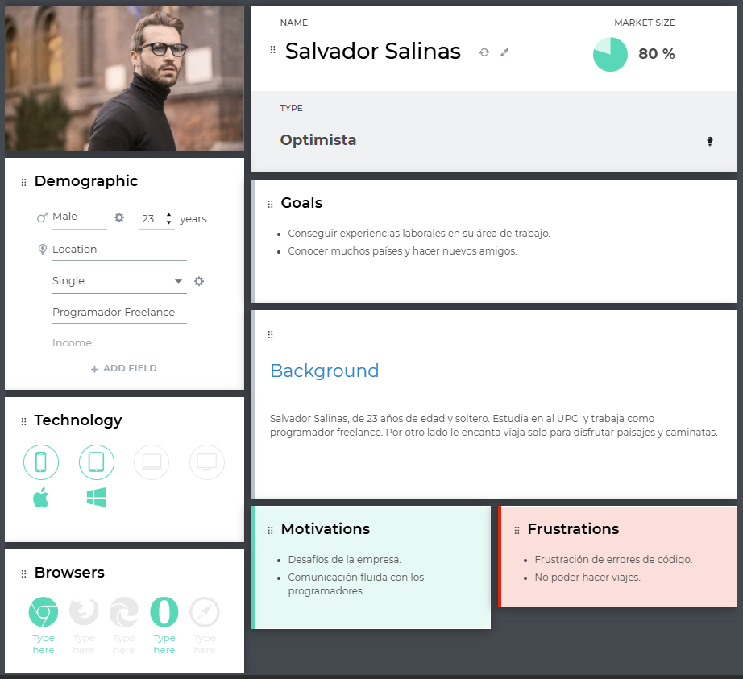
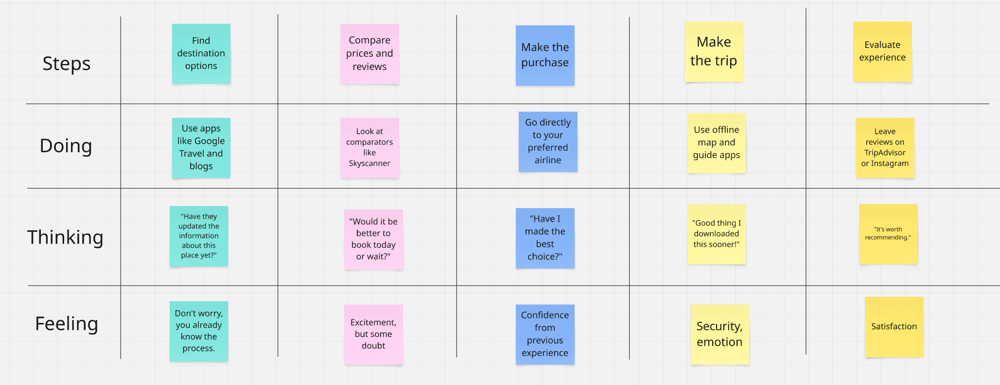

# report

### Universidad Peruana de ciencias Aplicadas 

### Ingeniería de Software

### 2025-01

### Código del Curso   y Nombre del curso

### 4374 - Aplicaciones Web
### Nombre del profesor
### "Informe de Trabajo Final"
### Nombre del startup 
### Nombre del producto 
### Relación de integrantes (Incluyendo en cada caso Código, Apellidos y Nombres) 
### Mes y año 
---------------------------------------------------------------------------------------------------------------------------
### Tabla de contenidos
### Student Outcome

### Capítulo I: Introducción 

1.1. Startup Profile

1.1.1. Descripción de la Startup

1.1.2. Perfiles de integrantes del equipo

1.2. Solution Profile

1.2.1 Antecedentes y problemática

1.2.2 Lean UX Process.

1.2.2.1. Lean UX Problem Statements.

1.2.2.2. Lean UX Assumptions.

1.2.2.3. Lean UX Hypothesis Statements.

1.2.2.4. Lean UX Canvas.

1.3. Segmentos objetivo.

### Capítulo II: Requirements Elicitation & Analysis

2.1. Competidores.

2.1.1. Análisis competitivo.

2.1.2. Estrategias y tácticas frente a competidores.

2.2. Entrevistas.

2.2.1. Diseño de entrevistas.

2.2.2. Registro de entrevistas.

2.2.3. Análisis de entrevistas.

2.3. Needfinding.

Con el propósito de desarrollar una app que satisfaga las necesidades particulares de los usuarios, Ecotrip llevará a cabo la identificación del User persona, User Task Matrix, User Journey Maps y Empathy Mapping.

2.3.1. User Personas.

Para esta sección se han creado personajes ficticios, cada uno diseñado para representar a un segmento específico de usuarios. La información utilizada para desarrollar estos "User personas" proviene de entrevistas previas realizadas a cada segmento objetivo. Estas entrevistas tenían como objetivo comprender mejor a las personas a las que se dirige la aplicación. Se consideraron datos demográficos, metas, motivaciones, frustraciones, marcas relacionadas con el tema de la aplicación, canales digitales más utilizados, entre otros. La creación de esta sección se llevó a cabo utilizando la plataforma UXPressia.

- **Segmento objetivo: Programador Freelance y Turista**
  

2.3.2. User Task Matrix.

En esta sección se presenta el user task matrix, herramienta centrada en los segmentos objetivos, que nos permitirá identificar las tareas y objetivos claves de los usuarios. Además, nos permitirá priorizar características y funcionalidades al momento de realizar el product backlog. Para la frecuencia se han considerado cinco opciones:nunca ,casi nunca, a veces, a menudo ,siempre; y para la importancia tres opciones: bajo, medio, alto". En relación con la matriz de tareas de los usuarios, podemos identificar tanto las tareas de mayor frecuencia como las de mayor importancia, así como las diferencias y similitudes entre los diferentes tipos de usuarios.

<table><tr><th rowspan="2" valign="top"><b><i>User task Matrix</i></b></th><th colspan="2" valign="top"><b><i>Salvador Salinas</i></b></th><th colspan="2" valign="top">
<b><i>xxxxxxxxxx</i></b> 

<b><i></i></b>
</th></tr>
<tr><td valign="top"><b><i>Frecuencia</i></b> </td><td valign="top"><b><i>Importancia</i></b></td><td valign="top"><b><i>Frecuencia</i></b> </td><td valign="top"><b><i>Importancia</i></b></td></tr>
<tr><td>Registrarse</td><td><b><i>Una vez</i></b></td><td><b><i>Alta</i></b></td><td><b><i>Una vez</i></b></td><td><b><i>Alta</i></b></td></tr>
<tr><td>Iniciar sesión</td><td><b><i>Siempre</i></b></td><td><b><i>Alta</i></b></td><td><b><i>Siempre</i></b></td><td><b><i>Alta</i></b></td></tr>
<tr><td>Buscar tours</td><td><b><i>Siempre</i></b></td><td><b><i>Alta</i></b></td><td><b><i>Siempre</i></b></td><td><b><i>Alta</i></b></td></tr>
<tr><td>Reservar tours</td><td><b><i>Siempre</i></b></td><td><b><i>Alta</i></b></td><td><b><i>Siempre</i></b></td><td><b><i>Alta</i></b></td></tr>
<tr><td>Crear reseñas/comentarios</td><td><b><i>Siempre</i></b></td><td><b><i>Media</i></b></td><td><b><i>Siempre</i></b></td><td><b><i>Media</i></b></td></tr>
<tr><td>Editar perfil</td><td><b><i>Siempre</i></b></td><td><b><i>Alta</i></b></td><td><b><i>Siempre</i></b></td><td><b><i>Alta</i></b></td></tr>
<tr><td>Guardar tours favoritos</td><td><b><i>Siempre</i></b></td><td><b><i>Medio</i></b></td><td><b><i>Siempre</i></b></td><td><b><i>Medio</i></b></td></tr>
<tr><td>Recibir recomendaciones personalizadas</td><td><b><i>A veces</i></b></td><td><b><i>Baja</i></b></td><td><b><i>Casi nunca</i></b></td><td><b><i>Baja</i></b></td></tr>
</table>

**Para los Turistas Frecuentes, las tareas más importantes y recurrentes incluyen:**

- Buscar y reservar tours: Son actividades clave que definen su experiencia continua en la plataforma, por lo tanto tienen una frecuencia alta y una importancia alta.
- Guardar tours favoritos: Les permite planificar y comparar opciones, mejorando la experiencia personalizada.
- Recibir recomendaciones personalizadas: Es fundamental para facilitarles nuevas experiencias alineadas con sus intereses, por eso es tanto frecuente como valiosa.
- Iniciar sesión y editar perfil: Aunque rutinarias, son necesarias para una navegación fluida.

**Por otro lado, para los Turistas Ocasionales, las tareas más relevantes son:**

- Registrarse e iniciar sesión: Aunque menos frecuentes, son esenciales para acceder a cualquier funcionalidad dentro de la plataforma.
- Reservar tours: A pesar de ser usada ocasionalmente, tiene una alta importancia cuando ocurre.
- Buscar tours: Se realiza con menos frecuencia, pero es clave en su momento de decisión.

Ambos tipos de turistas comparten el interés por reservar tours y acceder al contenido básico, pero las funcionalidades como recomendaciones o guardar favoritos son significativamente más relevantes para los usuarios frecuentes. Esto refleja las diferentes necesidades y comportamientos entre quienes usan la plataforma esporádicamente frente a quienes la integran en su estilo de vida viajero.

2.3.3. User Journey Mapping.

En esta sección, se describen en detalle los User Journey Mapping para dos perfiles distintos de usuarios de la plataforma de turismo responsable: los Turistas Ocasionales y los Turistas Frecuentes. Estos mapas proporcionan una visión integral del recorrido que cada tipo de usuario realiza dentro del sistema, desde el primer contacto con la plataforma hasta su uso habitual y su interacción continua con las funcionalidades ofrecidas. Se destacan las etapas clave, las emociones y necesidades específicas de cada usuario, para asegurar una comprensión clara de su experiencia global.

*Para Turistas Ocasionales* 
- El recorrido del Turista Ocasional comienza generalmente por la búsqueda de opciones de viaje de manera espontánea, motivado por una necesidad puntual de escapar de la rutina o aprovechar una oportunidad (vacaciones, feriados, etc.). Su primer contacto con la plataforma suele ser a través de búsquedas orgánicas o recomendaciones de terceros.

- Una vez dentro, realiza el registro para poder acceder a contenido completo y proceder con la reserva de un tour. La experiencia debe ser intuitiva y sin fricción, ya que este tipo de usuario no está habituado a navegar frecuentemente por plataformas de este tipo.
  
- Después de su experiencia en el tour, puede dejar una reseña ocasional, aunque en muchos casos no vuelve a usar la plataforma a corto plazo, a menos que se generen recordatorios o recomendaciones personalizadas en el futuro.

*Para Turistas Frecuentes*
- El Turista Frecuente tiene un comportamiento más estratégico y constante. Su viaje inicia incluso antes del registro, con una exploración activa de opciones, muchas veces comparando múltiples experiencias de turismo responsable.
  
- Este usuario se registra con la intención de aprovechar funcionalidades avanzadas como guardar tours favoritos, recibir recomendaciones personalizadas, y gestionar múltiples reservas. Navega regularmente la plataforma, mantiene actualizado su perfil, y deja reseñas de sus experiencias, valorando la posibilidad de interactuar con la comunidad y contribuir a la mejora de los servicios ofrecidos.
  
- Su viaje es cíclico: busca, compara, reserva, evalúa, y repite. A lo largo del tiempo, se convierte en un embajador de la marca, recomendando la plataforma a otros viajeros y contribuyendo activamente a la mejora de los contenidos.

Tanto los Turistas Ocasionales como los Turistas Frecuentes comparten el deseo de acceder a experiencias significativas y auténticas de turismo responsable. Sin embargo, sus interacciones con la plataforma difieren en profundidad y frecuencia.

- #### *Turistas Ocasionales*
| Etapa                         | Acción del usuario (Turista ocasional)       | Emoción         | Canal                       | Oportunidad de mejora                           |
|------------------------------|----------------------------------------------|-----------------|-----------------------------|------------------------------------------------|
| Descubrimiento               | Encuentra la plataforma por redes o buscador | Curiosidad      | Web, redes sociales         | Mejorar posicionamiento SEO y contenido visual |
| Registro                     | Se registra para ver detalles de un tour     | Interés         | Página web                  | Simplificar el proceso de registro             |
| Exploración                  | Navega tours sin un objetivo claro           | Confusión       | Navegador                   | Sugerencias iniciales según localización       |
| Reserva                      | Selecciona y reserva un tour                 | Satisfacción    | Página de reservas          | Ofrecer asistencia en tiempo real              |
| Participación en el tour     | Asiste a la actividad                        | Entusiasmo      | Presencial                  | Recordatorios y checklist antes del tour       |
| Post-experiencia             | Puede dejar una reseña o no                  | Desconexión     | Email, web                  | Incentivar feedback con recompensas            |

- #### *Turistas Frecuentes*
| Etapa                         | Acción del usuario (Turista frecuente)       | Emoción         | Canal                       | Oportunidad de mejora                           |
|------------------------------|----------------------------------------------|-----------------|-----------------------------|------------------------------------------------|
| Descubrimiento               | Visita frecuente para buscar nuevos tours    | Entusiasmo      | App, web                    | Notificaciones personalizadas                   |
| Registro                     | Ya registrado                                | Confianza       | Web/App                     | Acceso rápido con login automático              |
| Exploración                  | Usa filtros, compara, guarda favoritos       | Seguridad       | App, navegador              | Mostrar experiencias similares                  |
| Reserva                      | Reserva múltiples tours                      | Expectativa     | Plataforma                  | Ofrecer paquetes personalizados                 |
| Participación en el tour     | Asiste a las actividades                     | Entusiasmo      | Presencial                  | Opciones de compartir en redes sociales         |
| Post-experiencia             | Deja reseña y comparte experiencia           | Compromiso      | Web, email, redes           | Programa de fidelización o referidos            |

2.3.4. Empathy Mapping.

En esta sección se aborda el Empathy Mapping, una herramienta esencial para elaborar perfiles detallados de los user personas y profundizar en la comprensión de su perspectiva y experiencia. Cada user persona se analiza a través de cinco elementos cruciales: lo que el usuario ve, escucha,dice, hace y siente. Además, se identifican los problemas (pains) y beneficios (gains) de acuerdo con una serie de preguntas estratégicas:¿Qué preocupaciones o desafíos enfrenta el usuario en su trabajo diario?¿Qué mejoras o soluciones podrían resolver los problemas identificados?¿Qué argumentos podrían persuadir al usuario de que nuestra solución es la mejor opción para satisfacer sus necesidades profesionales?

En esta sección se aborda el Empathy Mapping, una herramienta esencial para construir perfiles detallados de los user personas y profundizar en la comprensión de su perspectiva y experiencia durante la interacción con la plataforma. Este análisis se ha estructurado considerando cinco elementos clave: lo que el usuario ve, escucha, dice, hace y siente, además de identificar los problemas (pains) y beneficios (gains) que marcan su recorrido y necesidades.

- **Segmento: Turistas Frecuentes**

| Etapa                | Registro                          | Búsqueda de tours                     | Reserva                              | Experiencia del tour                    | Revisión y seguimiento                   |
|---------------------|------------------------------------|----------------------------------------|----------------------------------------|------------------------------------------|------------------------------------------|
| **User goals**      | Acceder rápidamente a su cuenta    | Encontrar experiencias únicas y nuevas | Reservar sin repetir datos            | Tener un servicio ágil y profesional     | Dejar feedback o repetir experiencia     |
| **Touchpoints**     | Login con Google/Facebook          | Filtros avanzados, tours recomendados  | Perfil guardado con datos precargados | Confirmaciones automáticas, asistencia 24/7 | Correo de agradecimiento, link a favoritos |
| **Customer Thought**| “Ya tengo cuenta, quiero entrar ya”| “¿Hay algo nuevo o diferente?”         | “¿Puedo reservar en 2 clics?”         | “¿Tendré soporte si algo falla?”        | “¿Vale la pena repetir o recomendar?”   |
| **Experience**      | 😄 Rápida y eficiente               | 🙂 Curiosa y motivada                  | 😄 Satisfactoria                       | 😄 Profesional y sin contratiempos       | 😄 Positiva y leal                       |
| **Ideas/Opps**      | Recordar sesión automáticamente     | Notificaciones de nuevos tours         | Botón de reserva rápida               | Chatbot o número de contacto directo     | Programa de recompensas o referidos      |

- **Segmento: Turistas Ocasionales**

| Etapa                | Registro                                | Búsqueda de tours                       | Reserva                                 | Experiencia del tour                      | Revisión y seguimiento                    |
|---------------------|------------------------------------------|------------------------------------------|------------------------------------------|--------------------------------------------|--------------------------------------------|
| **User goals**      | Crear cuenta fácilmente                 | Encontrar un tour accesible sin mucho esfuerzo | Reservar rápido y sin complicaciones   | Tener una experiencia guiada y clara       | Confirmar que todo salió bien              |
| **Touchpoints**     | Registro con email o Google             | Tours destacados, búsqueda sencilla       | Pasarela de pago clara y guiada         | Instrucciones por correo/WhatsApp         | Enlace a reseña, agradecimiento             |
| **Customer Thought**| “¿Esto es fácil o toma tiempo?”         | “¿Este tour vale la pena?”               | “¿Es seguro pagar aquí?”                | “¿Sabré a dónde ir y qué hacer?”          | “¿Debo dejar una opinión?”                 |
| **Experience**      | 🙂 Intuitiva                             | 😐 Un poco indecisa                      | 🙂 Clara y sin estrés                   | 🙂 Cómoda y bien organizada                | 🙂 Positiva, pero breve                    |
| **Ideas/Opps**      | Acceso simplificado o invitado           | Mostrar reseñas visibles y puntuación    | Asistente visual durante la reserva     | Alertas automáticas y contacto rápido     | Incentivo por dejar reseña                |

2.3.5. As-is Scenario Mapping.

En esta sección se presenta el As-is Scenario Mapping para cada uno de los segmentos de usuarios identificados: Turistas Frecuentes y Turistas Ocasionales. Este análisis tiene como objetivo visualizar cómo interactúan actualmente estos usuarios con plataformas digitales para planificar y reservar experiencias de viaje, y así detectar puntos de mejora, frustraciones y oportunidades no exploradas.

El proceso contempla las siguientes fases clave: Descubrimiento, Evaluación, Reserva, Experiencia y Seguimiento. En cada una se destacan tanto los aspectos positivos como negativos vividos por los usuarios, así como las áreas en las que aún se requiere mayor investigación.

*As-is Scenario mapping: Turistas Frecuentes*
  
  

*As-is Scenario mapping: Turistas Ocasionales*
  
  

2.4. Ubiquitous Language.

### Capítulo III: Requirements Specification

3.1. To-Be Scenario Mapping.

3.2. User Stories.

3.3. Impact Mapping.

#### Mapa de segmento turistas responsable:

#### Mapa de segmento proveedores turisticos ecologicos:

3.4. Product Backlog.

|ID | Título | Prioridad | Descripción|
|--------------|--------------|--------------|--------------|
|US-01 | Ver lista de experiencias sostenibles | Alta | Como turista ocasional quiero ver una lista de experiencias para explorar qué ofrece EcoTrip.|
|US-01.1 | Filtrar experiencias por tipo | Alta | Como turista frecuente quiero filtrar experiencias por tipo para encontrar lo que me interesa.|
|US-02 | Registro de proveedores | Alta | Como proveedor quiero registrarme para ofrecer mis servicios turísticos sostenibles.|
|US-02.1 | Aprobación de proveedor | Alta | Como administrador quiero revisar y aprobar solicitudes de proveedores.|
|US-03 | Crear plan de viaje personalizado | Media | Como turista frecuente quiero armar mi propio itinerario con actividades y hospedajes.|
|US-03.1 | Sugerencias de itinerario basadas en intereses | Media | Como turista ocasional quiero recibir sugerencias de actividades según mi perfil.|
|US-04 | Conexión con guías turísticos | Alta | Como turista frecuente quiero contactar guías que hablen mi idioma.|
|US-04.1 | Reservar guía específico | Media | Como turista ocasional quiero poder reservar a un guía en específico.|
|US-05 | Reservar y pagar experiencias | Alta | Como turista frecuente quiero reservar y pagar actividades de manera fácil.|
|US-05.1 | Cancelar reserva y recibir reembolso | Media | Como turista ocasional quiero cancelar mi reserva si no podré asistir.|
|US-06 | Página informativa sobre EcoTrip | Media | Como visitante quiero saber qué es EcoTrip y qué servicios ofrece.|
|US-06.1 | Ver testimonios de otros viajeros | Baja | Como visitante quiero leer opiniones para confiar en la plataforma.|
|US-07 | Gestión del portafolio de proveedores | Alta | Como proveedor quiero agregar, editar o eliminar mis experiencias.|
|US-08 | Mejorar visibilidad de proveedores | Media | Como proveedor quiero mostrar mis calificaciones y reseñas públicas.|
|US-09 | Registro y validación fácil para proveedores | Alta | Como proveedor quiero un proceso de registro rápido y sencillo.|
|US-10 | Recibir pagos seguros como proveedor | Alta | Como proveedor quiero recibir mis pagos de manera segura y poder ver mi historial.|

### Capítulo IV: Product Design

4.1. Style Guidelines.

Con el objetivo de asegurar coherencia visual y comunicacional a lo largo de todos los puntos de contacto con los usuarios, se define una guía de estilo centralizada para el equipo de diseño y desarrollo. Esta guía permitirá mantener una presentación consistente tanto en plataformas web como móviles, alineada con los valores de sostenibilidad, inclusión y responsabilidad promovidos por EcoTrip.

4.1.1. General Style Guidelines.

Aquí se explica las decisiones y referencias visuales sobre conceptos generales básicos como Branding, Typography, Colors y Spacing, así como las dimensiones a adoptar para el tono de comunicación y lenguaje aplicado (Divertido/Serio, Formal/Casual, Respetuoso/Irreverente, Entusiasta/Sereno). Puede tomarse como referencia un Design System existente, sobre el cual se puede realizar adaptaciones.

#### Branding
EcoTrip comunica sostenibilidad, autenticidad y conexión con la naturaleza. Su identidad visual transmite cercanía, confianza y respeto cultural. El logotipo utiliza una tipografía moderna y amigable, evocando caminos y hojas que representan el viaje y la ecología.

#### Typography
Se utilizan fuentes limpias y legibles:

- **Primaria:** *Poppins* – utilizada para títulos y navegación, aporta modernidad y claridad.
- **Secundaria:** *Open Sans* – aplicada en cuerpos de texto, facilita la lectura prolongada.

Ambas fuentes están disponibles en Google Fonts, lo que facilita su integración en entornos web y móviles.

#### Colors
La paleta de colores se inspira en la naturaleza, transmitiendo calma y responsabilidad ambiental:

- **Verde Bosque (#4CAF50):** color principal que representa sostenibilidad y acción responsable.
- **Verde Lima (#C5E1A5):** secundario, aporta energía y frescura.
- **Beige Tierra (#FFF8E1):** fondo neutro y cálido, amigable a la vista.
- **Gris Suave (#757575):** utilizado en textos secundarios o de soporte.
- **Blanco (#FFFFFF):** proporciona limpieza visual y contraste.

#### Spacing
Se define una escala modular de espaciado basada en múltiplos de 8px (8, 16, 24, 32, etc.), lo cual facilita la organización de layouts consistentes y balanceados visualmente.

#### Tono y Lenguaje
EcoTrip adopta un lenguaje accesible y empático:

- **Tono:** cercano, optimista y comprometido con el usuario.
- **Lenguaje:**  
  - Entre **casual y respetuoso**, evitando tecnicismos innecesarios.  
  - **Entusiasta**, pero no invasivo.  
  - Inspirador y culturalmente sensible, especialmente en interacciones con comunidades locales.

**Ejemplo de voz:**

- ✅ “¿Listo para vivir una experiencia inolvidable en la selva amazónica?”
- ❌ “Reserva ya o te lo pierdes.”

---

4.1.2. Web Style Guidelines.

En esta sección se explica e ilustra las decisiones sobre los estándares visuales y de interacción para responsive web interfaces.

#### Diseño Responsive
EcoTrip utiliza un diseño adaptable que se ajusta a distintos dispositivos: computadoras, tablets y smartphones, manteniendo la coherencia visual.

#### Botones

- Forma: redondeados (12px de radio).
- Colores: uso del verde principal (#4CAF50) con texto blanco.
- Estados: `hover`, `active` y `disabled` definidos claramente.
- Iconografía: acompañados de íconos solo cuando añaden significado.

#### Navegación

- Barra superior fija con logo alineado a la izquierda.
- Enlaces principales: “Explorar”, “Mi Plan”, “Perfil”.
- Comportamiento: la barra cambia de color ligeramente al hacer scroll.

#### Accesibilidad

- Contraste de color superior a 4.5:1.
- Tipografía escalable sin romper diseño.
- Navegación con teclado y etiquetas `aria-label` para elementos interactivos.

#### Animaciones

- Transiciones suaves entre secciones (`0.3s a 0.5s`).
- Efectos sutiles de entrada y desplazamiento en los elementos clave.
- Sin uso excesivo de animaciones para no afectar el rendimiento ni distraer al usuario.

#### Sustento de diseño

Se toman como referencia principios del **Material Design** de Google y el sistema de diseño de **Airbnb**, por su enfoque en experiencias culturales, accesibilidad y claridad visual. Además, se adaptan las guías al contexto de turismo sostenible, garantizando:

- **Consistencia** visual entre pantallas.
- **Escalabilidad** del diseño a nuevas funcionalidades.
- **Usabilidad** y accesibilidad para todo tipo de usuarios.

---

4.2. Information Architecture.

En esta sección se definen las decisiones de arquitectura de información que dirigen cómo se organizará el contenido en las experiencias web de **EcoTrip**, incluyendo el Landing Page y futuras aplicaciones. El objetivo principal es garantizar que los visitantes y usuarios se adapten de manera intuitiva a la funcionalidad de cada producto, puedan encontrar fácilmente lo que necesitan y logren una navegación fluida y satisfactoria.

Las propuestas de arquitectura están diseñadas siguiendo principios de usabilidad, claridad y accesibilidad, abordando los siguientes componentes:

- **Organization Systems**
- **Labeling Systems**
- **SEO Tags and Meta Tags**
- **Searching Systems**
- **Navigation Systems**

4.2.1. Organization Systems.

Se establecen las siguientes decisiones sobre la organización del contenido:

####  Visual Hierarchy
Se aplicará una **jerarquía visual clara** en todas las páginas, priorizando:

- **Primero:** Secciones principales como "Explorar", "Mi Plan", "Reservas".
- **Luego:** Subcategorías como tipos de experiencias (Voluntariado, Ecotours, Aventura).
- **Finalmente:** Información detallada de cada actividad o guía.

El tamaño, color y peso de los elementos gráficos ayudarán a guiar la atención del usuario hacia lo más relevante.

####  Secuencial Organization
En procesos como:

- **Registro de Proveedores**
- **Creación de Itinerarios Personalizados**
- **Proceso de Reserva**

Se utilizará una organización **secuencial paso a paso**, facilitando al usuario completar acciones en un orden lógico y guiado.

Ejemplo de pasos en creación de itinerario:
1. Seleccionar actividades.
2. Escoger hospedaje.
3. Confirmar transporte.
4. Guardar y visualizar el plan.

####  Matricial Organization
Para listas de experiencias o actividades disponibles, se aplicará un modelo **matricial**, donde el usuario puede comparar varias opciones al mismo nivel mediante filtros (por precio, popularidad, impacto ambiental, tipo de actividad).

---

####  Esquemas de Categorización

Según el tipo de contenido, se emplearán:

- **Por tópicos:** experiencias agrupadas en categorías como "Aventura", "Cultural", "Voluntariado", "Ecológico".
- **Según audiencia:** filtrado de experiencias recomendadas para "Turistas Frecuentes" y "Turistas Ocasionales".
- **Cronológico:** para visualizar actividades próximas a realizarse (eventos en fechas específicas).
- **Alfabético:** listado de proveedores o guías por nombre, en catálogos extensos.

Estos esquemas permiten un acceso eficiente y adaptado a diferentes formas de búsqueda del usuario.

---

4.2.2. Labeling Systems.

La representación de los datos en la plataforma busca ser clara, intuitiva y evitar confusión. Para ello se establecen las siguientes directrices de etiquetado:

#### 🔹 Principios de Etiquetado

- Utilizar un **mínimo número de palabras**.
- Preferir términos **comunes** y **fáciles de comprender**.
- Mantener **consistencia** en la terminología a lo largo del sitio.

#### 🔹 Etiquetas principales propuestas

| Área                | Etiqueta asignada    | Propósito                          |
|---------------------|----------------------|------------------------------------|
| Exploración          | "Explorar"           | Navegar entre experiencias.        |
| Planificación        | "Mi Plan"            | Acceso al itinerario personalizado.|
| Reservas             | "Mis Reservas"       | Historial de reservas confirmadas. |
| Registro de Proveedores | "Conviértete en proveedor" | Registro de nuevos servicios. |
| Búsqueda             | "Buscar experiencias" | Entrada de texto para buscar.     |
| Perfil               | "Mi Perfil"          | Datos personales del usuario.      |

Además, las etiquetas dentro de los filtros utilizarán palabras clave simples como:

- "Tipo de experiencia"
- "Duración"
- "Nivel de impacto ecológico"
- "Idioma del guía"

Esto facilita al usuario la interpretación inmediata de las opciones disponibles.

---

4.2.3. SEO Tags and Meta Tags

Para optimizar la visibilidad y accesibilidad de EcoTrip en motores de búsqueda, se establecen los siguientes **SEO Tags** y **Meta Tags** que serán implementados tanto en el **Landing Page** como en la **Web Application**:

| Página             | Title                                    | Meta Description                                              | Meta Keywords                         | Author         |
|--------------------|------------------------------------------|---------------------------------------------------------------|---------------------------------------|----------------|
| Landing Page       | EcoTrip - Vive Experiencias Sostenibles  | Descubre y reserva experiencias de turismo ecológico auténtico alrededor del mundo con EcoTrip. | ecoturismo, turismo sostenible, experiencias eco, viajes responsables | Equipo EcoTrip |
| Web Application - Home | EcoTrip App - Tu Viaje Responsable Comienza Aquí | Organiza, personaliza y reserva experiencias sostenibles de forma sencilla y segura. | crear itinerario ecológico, plan de viaje sostenible, actividades eco | Equipo EcoTrip |
| Web Application - Perfil Usuario | EcoTrip - Mi Perfil | Gestiona tus datos, itinerarios y reservas ecológicas en EcoTrip. | perfil usuario EcoTrip, reservas turismo ecológico | Equipo EcoTrip |

4.2.4. Searching Systems.

Para mejorar la capacidad de búsqueda dentro del sitio y aplicación, se implementarán sistemas de búsqueda claros y efectivos.

####  Tipos de búsqueda ofrecidos

- **Búsqueda Global (Header Search Box):**
  - Visible en todas las páginas principales.
  - Permite buscar experiencias, guías o categorías.
  - Autocompletado con sugerencias relevantes.

- **Filtros de búsqueda en "Explorar experiencias":**
  - **Tipo de experiencia** (Voluntariado, Ecotour, Aventura, Cultura).
  - **Duración** (1 día, 2-5 días, +7 días).
  - **Nivel de impacto ecológico** (Certificado eco, Responsable, Sugerido).
  - **Ubicación** (continente, país o región).
  - **Idioma del guía**.

- **Búsqueda específica en el perfil de proveedores:**
  - Por nombre del proveedor.
  - Por calificación de usuarios.

####  Presentación de resultados

- **Resultados dinámicos:** a medida que se aplica un filtro o búsqueda, el listado se actualiza en tiempo real.
- **Organización matricial:** los resultados se mostrarán en tarjetas (cards) que incluyen:
  - Imagen de la experiencia o proveedor.
  - Nombre y categoría.
  - Valoración promedio.
  - Botón de acción (Agregar a plan, Reservar).

- **Resultados ordenables:** por relevancia, precio, valoración o fecha de disponibilidad.

---

4.2.5. Navigation Systems.

La navegación del producto EcoTrip está diseñada para guiar a los usuarios de manera fluida, asegurando que encuentren lo que buscan de manera natural e intuitiva.

####  Principios de navegación
- **Navegación principal fija:** barra superior presente en todo momento, accesible desde cualquier parte de la aplicación.
- **Accesos rápidos:** a las secciones principales: "Explorar", "Mi Plan", "Reservas", "Perfil".
- **Navegación progresiva:** acciones importantes (crear itinerario, reservar, contactar guía) se presentan en momentos contextuales apropiados, evitando saturación.
- **Pistas visuales:** utilización de colores, íconos y estados activos en menús para indicar dónde se encuentra el usuario.
- **Breadcrumbs:** en procesos secuenciales como la creación de itinerarios, para mostrar al usuario en qué etapa se encuentra.

####  Flujo de navegación en Landing Page

1. El visitante accede a la **Landing Page**.
2. Puede navegar rápidamente a:
   - Explorar experiencias
   - Conocer más sobre EcoTrip
   - Registrarse como turista o proveedor
3. Se invita a la acción con CTA claros como **"Empieza tu viaje responsable"**.

####  Flujo de navegación en la Web Application

1. Menú principal con íconos + texto (Inicio, Explorar, Mi Plan, Perfil).
2. En "Explorar", se filtra experiencias y se agregan al plan.
3. Desde "Mi Plan", se visualiza el itinerario y se procede a reservar.
4. En "Perfil", se gestionan datos, historial y configuraciones.

---

4.3. Landing Page UI Design.

4.3.1. Landing Page Wireframe.

4.3.2. Landing Page Mock-up.

A continuación los Mock ups, estos son los modelos de diseño que se utilizarán en la elaboración del landing page y servirá de modelo y base para la elaboración del programa. 

4.4. Web Applications UX/UI Design.

4.4.1. Web Applications Wireframes.

4.4.2. Web Applications Wireflow Diagrams.

4.4.2. Web Applications Mock-ups.

4.4.3. Web Applications User Flow Diagrams.

4.5. Web Applications Prototyping.

4.6. Domain-Driven Software Architecture.

4.6.1. Software Architecture Context Diagram.

4.6.2. Software Architecture Container Diagrams.

4.6.3. Software Architecture Components Diagrams.

4.7. Software Object-Oriented Design.

4.7.1. Class Diagrams.

4.7.2. Class Dictionary.

4.8. Database Design.

4.8.1. Database Diagram.

### Capítulo V: Product Implementation, Validation & Deployment

5.1. Software Configuration Management.

5.1.1. Software Development Environment Configuration.

5.1.2. Source Code Management.

5.1.3. Source Code Style Guide & Conventions.

5.1.4. Software Deployment Configuration.

5.2. Landing Page, Services & Applications Implementation.

5.2.X. Sprint n

5.2.X.1. Sprint Planning n.

5.2.X.2. Aspect Leaders and Collaborators.

5.2.X.3. Sprint Backlog n.

5.2.X.4. Development Evidence for Sprint Review.

5.2.X.5. Execution Evidence for Sprint Review.

5.2.X.6. Services Documentation Evidence for Sprint Review.

5.2.X.7. Software Deployment Evidence for Sprint Review.

5.2.X.8. Team Collaboration Insights during Sprint.

5.3. Validation Interviews.

5.3.1. Diseño de Entrevistas.

5.3.2. Registro de Entrevistas.

5.3.3. Evaluaciones según heurísticas.

5.4. Video About-the-Product.

### Conclusiones
### Conclusiones y recomendaciones.
### Video About-the-Team.

