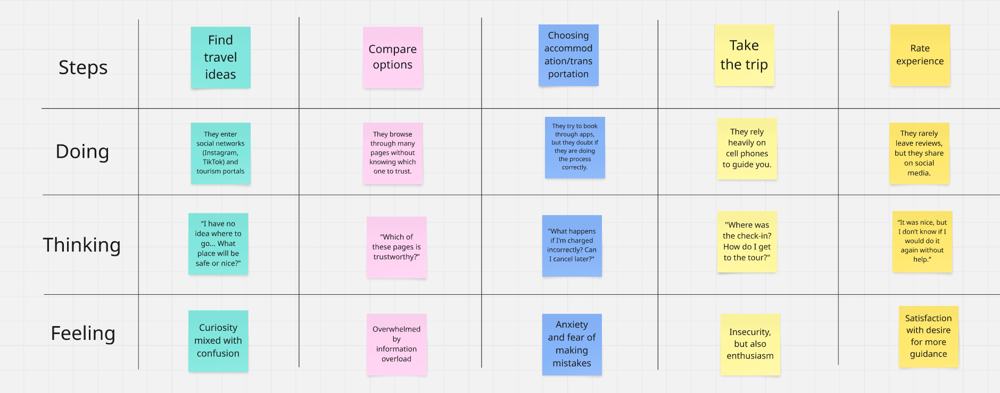
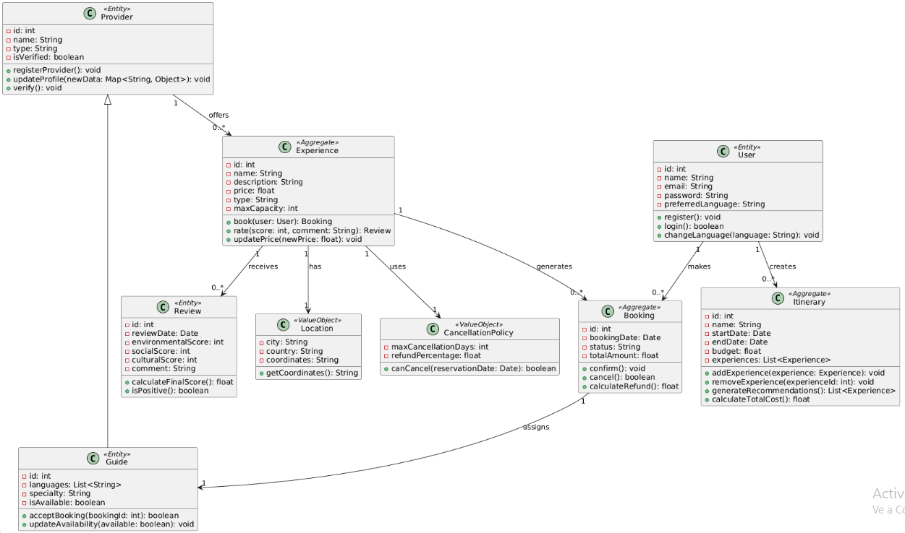

# report

### Universidad Peruana de ciencias Aplicadas

### Ingeniería de Software

### 2025-01

### Código del Curso   y Nombre del curso

### 4374 - Aplicaciones Web

### Nombre del profesor

### "Informe de Trabajo Final"

### Nombre del startup 

### Nombre del producto 

### Relación de integrantes (Incluyendo en cada caso Código, Apellidos y Nombres) 

### Mes y año 

---

### Tabla de contenidos

### Student Outcome

### Capítulo I: Introducción 

1.1. Startup Profile

1.1.1. Descripción de la Startup

1.1.2. Perfiles de integrantes del equipo

1.2. Solution Profile

1.2.1 Antecedentes y problemática

1.2.2 Lean UX Process.

1.2.2.1. Lean UX Problem Statements.

1.2.2.2. Lean UX Assumptions.

1.2.2.3. Lean UX Hypothesis Statements.

1.2.2.4. Lean UX Canvas.

1.3. Segmentos objetivo.

### Capítulo II: Requirements Elicitation & Analysis

2.1. Competidores.

2.1.1. Análisis competitivo.

2.1.2. Estrategias y tácticas frente a competidores.

2.2. Entrevistas.

2.2.1. Diseño de entrevistas.

2.2.2. Registro de entrevistas.

2.2.3. Análisis de entrevistas.

2.3. Needfinding.

2.3.1. User Personas.

2.3.2. User Task Matrix.

2.3.3. User Journey Mapping.

2.3.4. Empathy Mapping.

2.3.5. As-is Scenario Mapping.

2.4. Ubiquitous Language.

### Capítulo III: Requirements Specification

3.1. To-Be Scenario Mapping.

3.2. User Stories.

3.3. Impact Mapping.

3.4. Product Backlog.

### Capítulo IV: Product Design

4.1. Style Guidelines.

4.1.1. General Style Guidelines.

4.1.2. Web Style Guidelines.

4.2. Information Architecture.

4.2.1. Organization Systems.

4.2.2. Labeling Systems.

4.2.3. SEO Tags and Meta Tags

4.2.4. Searching Systems.

4.2.5. Navigation Systems.

4.3. Landing Page UI Design.

4.3.1. Landing Page Wireframe.

4.3.2. Landing Page Mock-up.

4.4. Web Applications UX/UI Design.

4.4.1. Web Applications Wireframes.

4.4.2. Web Applications Wireflow Diagrams.

4.4.2. Web Applications Mock-ups.

4.4.3. Web Applications User Flow Diagrams.

4.5. Web Applications Prototyping.

4.6. Domain-Driven Software Architecture.

4.6.1. Software Architecture Context Diagram.

4.6.2. Software Architecture Container Diagrams.

4.6.3. Software Architecture Components Diagrams.

4.7. Software Object-Oriented Design.

4.7.1. Class Diagrams.

4.7.2. Class Dictionary.

4.8. Database Design.

4.8.1. Database Diagram.

### Capítulo V: Product Implementation, Validation & Deployment

5.1. Software Configuration Management.

5.1.1. Software Development Environment Configuration.

5.1.2. Source Code Management.

5.1.3. Source Code Style Guide & Conventions.

5.1.4. Software Deployment Configuration.

5.2. Landing Page, Services & Applications Implementation.

5.2.X. Sprint n

5.2.X.1. Sprint Planning n.

5.2.X.2. Aspect Leaders and Collaborators.

5.2.X.3. Sprint Backlog n.

5.2.X.4. Development Evidence for Sprint Review.

5.2.X.5. Execution Evidence for Sprint Review.

5.2.X.6. Services Documentation Evidence for Sprint Review.

5.2.X.7. Software Deployment Evidence for Sprint Review.

5.2.X.8. Team Collaboration Insights during Sprint.

5.3. Validation Interviews.

5.3.1. Diseño de Entrevistas.

5.3.2. Registro de Entrevistas.

5.3.3. Evaluaciones según heurísticas.

5.4. Video About-the-Product.

### Conclusiones

### Conclusiones y recomendaciones.

### Video About-the-Team.

##  2.3. Needfinding

Con el propósito de desarrollar una app que satisfaga las necesidades particulares de los usuarios, Ecotrip llevará a cabo la identificación del User persona, User Task Matrix, User Journey Maps y Empathy Mapping.

###  2.3.1. User Personas

Para esta sección se han creado personajes ficticios, cada uno diseñado para representar a un segmento específico de usuarios. La información utilizada para desarrollar estos "User personas" proviene de entrevistas previas realizadas a cada segmento objetivo. Estas entrevistas tenían como objetivo comprender mejor a las personas a las que se dirige la aplicación. Se consideraron datos demográficos, metas, motivaciones, frustraciones, marcas relacionadas con el tema de la aplicación, canales digitales más utilizados, entre otros. La creación de esta sección se llevó a cabo utilizando la plataforma UXPressia.

- **Segmento objetivo: Programador Freelance y Turista**

###  2.3.2. User Task Matrix

En esta sección se presenta el user task matrix, herramienta centrada en los segmentos objetivos, que nos permitirá identificar las tareas y objetivos claves de los usuarios. Además, nos permitirá priorizar características y funcionalidades al momento de realizar el product backlog. Para la frecuencia se han considerado cinco opciones:nunca ,casi nunca, a veces, a menudo ,siempre; y para la importancia tres opciones: bajo, medio, alto". En relación con la matriz de tareas de los usuarios, podemos identificar tanto las tareas de mayor frecuencia como las de mayor importancia, así como las diferencias y similitudes entre los diferentes tipos de usuarios.

<table><tr><th rowspan="2" valign="top"><b><i>User task Matrix</i></b></th><th colspan="2" valign="top"><b><i>Salvador Salinas</i></b></th><th colspan="2" valign="top">
<b><i>xxxxxxxxxx</i></b> 

<b><i></i></b>
</th></tr>
<tr><td valign="top"><b><i>Frecuencia</i></b> </td><td valign="top"><b><i>Importancia</i></b></td><td valign="top"><b><i>Frecuencia</i></b> </td><td valign="top"><b><i>Importancia</i></b></td></tr>
<tr><td>Registrarse</td><td><b><i>Una vez</i></b></td><td><b><i>Alta</i></b></td><td><b><i>Una vez</i></b></td><td><b><i>Alta</i></b></td></tr>
<tr><td>Iniciar sesión</td><td><b><i>Siempre</i></b></td><td><b><i>Alta</i></b></td><td><b><i>Siempre</i></b></td><td><b><i>Alta</i></b></td></tr>
<tr><td>Buscar tours</td><td><b><i>Siempre</i></b></td><td><b><i>Alta</i></b></td><td><b><i>Siempre</i></b></td><td><b><i>Alta</i></b></td></tr>
<tr><td>Reservar tours</td><td><b><i>Siempre</i></b></td><td><b><i>Alta</i></b></td><td><b><i>Siempre</i></b></td><td><b><i>Alta</i></b></td></tr>
<tr><td>Crear reseñas/comentarios</td><td><b><i>Siempre</i></b></td><td><b><i>Media</i></b></td><td><b><i>Siempre</i></b></td><td><b><i>Media</i></b></td></tr>
<tr><td>Editar perfil</td><td><b><i>Siempre</i></b></td><td><b><i>Alta</i></b></td><td><b><i>Siempre</i></b></td><td><b><i>Alta</i></b></td></tr>
<tr><td>Guardar tours favoritos</td><td><b><i>Siempre</i></b></td><td><b><i>Medio</i></b></td><td><b><i>Siempre</i></b></td><td><b><i>Medio</i></b></td></tr>
<tr><td>Recibir recomendaciones personalizadas</td><td><b><i>A veces</i></b></td><td><b><i>Baja</i></b></td><td><b><i>Casi nunca</i></b></td><td><b><i>Baja</i></b></td></tr>
</table>

**Para los Turistas Frecuentes, las tareas más importantes y recurrentes incluyen:**

- Buscar y reservar tours: Son actividades clave que definen su experiencia continua en la plataforma, por lo tanto tienen una frecuencia alta y una importancia alta.
- Guardar tours favoritos: Les permite planificar y comparar opciones, mejorando la experiencia personalizada.
- Recibir recomendaciones personalizadas: Es fundamental para facilitarles nuevas experiencias alineadas con sus intereses, por eso es tanto frecuente como valiosa.
- Iniciar sesión y editar perfil: Aunque rutinarias, son necesarias para una navegación fluida.

**Por otro lado, para los Turistas Ocasionales, las tareas más relevantes son:**

- Registrarse e iniciar sesión: Aunque menos frecuentes, son esenciales para acceder a cualquier funcionalidad dentro de la plataforma.
- Reservar tours: A pesar de ser usada ocasionalmente, tiene una alta importancia cuando ocurre.
- Buscar tours: Se realiza con menos frecuencia, pero es clave en su momento de decisión.

Ambos tipos de turistas comparten el interés por reservar tours y acceder al contenido básico, pero las funcionalidades como recomendaciones o guardar favoritos son significativamente más relevantes para los usuarios frecuentes. Esto refleja las diferentes necesidades y comportamientos entre quienes usan la plataforma esporádicamente frente a quienes la integran en su estilo de vida viajero.

###  2.3.3. User Journey Mapping

En esta sección, se describen en detalle los User Journey Mapping para dos perfiles distintos de usuarios de la plataforma de turismo responsable: los Turistas Ocasionales y los Turistas Frecuentes. Estos mapas proporcionan una visión integral del recorrido que cada tipo de usuario realiza dentro del sistema, desde el primer contacto con la plataforma hasta su uso habitual y su interacción continua con las funcionalidades ofrecidas. Se destacan las etapas clave, las emociones y necesidades específicas de cada usuario, para asegurar una comprensión clara de su experiencia global.

_Para Turistas Ocasionales_

- El recorrido del Turista Ocasional comienza generalmente por la búsqueda de opciones de viaje de manera espontánea, motivado por una necesidad puntual de escapar de la rutina o aprovechar una oportunidad (vacaciones, feriados, etc.). Su primer contacto con la plataforma suele ser a través de búsquedas orgánicas o recomendaciones de terceros.

- Una vez dentro, realiza el registro para poder acceder a contenido completo y proceder con la reserva de un tour. La experiencia debe ser intuitiva y sin fricción, ya que este tipo de usuario no está habituado a navegar frecuentemente por plataformas de este tipo.
- Después de su experiencia en el tour, puede dejar una reseña ocasional, aunque en muchos casos no vuelve a usar la plataforma a corto plazo, a menos que se generen recordatorios o recomendaciones personalizadas en el futuro.

_Para Turistas Frecuentes_

- El Turista Frecuente tiene un comportamiento más estratégico y constante. Su viaje inicia incluso antes del registro, con una exploración activa de opciones, muchas veces comparando múltiples experiencias de turismo responsable.
- Este usuario se registra con la intención de aprovechar funcionalidades avanzadas como guardar tours favoritos, recibir recomendaciones personalizadas, y gestionar múltiples reservas. Navega regularmente la plataforma, mantiene actualizado su perfil, y deja reseñas de sus experiencias, valorando la posibilidad de interactuar con la comunidad y contribuir a la mejora de los servicios ofrecidos.
- Su viaje es cíclico: busca, compara, reserva, evalúa, y repite. A lo largo del tiempo, se convierte en un embajador de la marca, recomendando la plataforma a otros viajeros y contribuyendo activamente a la mejora de los contenidos.

Tanto los Turistas Ocasionales como los Turistas Frecuentes comparten el deseo de acceder a experiencias significativas y auténticas de turismo responsable. Sin embargo, sus interacciones con la plataforma difieren en profundidad y frecuencia.

- #### _Turistas Ocasionales_

  | Etapa                    | Acción del usuario (Turista ocasional)       | Emoción      | Canal               | Oportunidad de mejora                          |
  | ------------------------ | -------------------------------------------- | ------------ | ------------------- | ---------------------------------------------- |
  | Descubrimiento           | Encuentra la plataforma por redes o buscador | Curiosidad   | Web, redes sociales | Mejorar posicionamiento SEO y contenido visual |
  | Registro                 | Se registra para ver detalles de un tour     | Interés      | Página web          | Simplificar el proceso de registro             |
  | Exploración              | Navega tours sin un objetivo claro           | Confusión    | Navegador           | Sugerencias iniciales según localización       |
  | Reserva                  | Selecciona y reserva un tour                 | Satisfacción | Página de reservas  | Ofrecer asistencia en tiempo real              |
  | Participación en el tour | Asiste a la actividad                        | Entusiasmo   | Presencial          | Recordatorios y checklist antes del tour       |
  | Post-experiencia         | Puede dejar una reseña o no                  | Desconexión  | Email, web          | Incentivar feedback con recompensas            |

- #### _Turistas Frecuentes_
  | Etapa                    | Acción del usuario (Turista frecuente)    | Emoción     | Canal             | Oportunidad de mejora                   |
  | ------------------------ | ----------------------------------------- | ----------- | ----------------- | --------------------------------------- |
  | Descubrimiento           | Visita frecuente para buscar nuevos tours | Entusiasmo  | App, web          | Notificaciones personalizadas           |
  | Registro                 | Ya registrado                             | Confianza   | Web/App           | Acceso rápido con login automático      |
  | Exploración              | Usa filtros, compara, guarda favoritos    | Seguridad   | App, navegador    | Mostrar experiencias similares          |
  | Reserva                  | Reserva múltiples tours                   | Expectativa | Plataforma        | Ofrecer paquetes personalizados         |
  | Participación en el tour | Asiste a las actividades                  | Entusiasmo  | Presencial        | Opciones de compartir en redes sociales |
  | Post-experiencia         | Deja reseña y comparte experiencia        | Compromiso  | Web, email, redes | Programa de fidelización o referidos    |

###  2.3.4. Empathy Mapping

En esta sección se aborda el Empathy Mapping, una herramienta esencial para elaborar perfiles detallados de los user personas y profundizar en la comprensión de su perspectiva y experiencia. Cada user persona se analiza a través de cinco elementos cruciales: lo que el usuario ve, escucha,dice, hace y siente. Además, se identifican los problemas (pains) y beneficios (gains) de acuerdo con una serie de preguntas estratégicas:¿Qué preocupaciones o desafíos enfrenta el usuario en su trabajo diario?¿Qué mejoras o soluciones podrían resolver los problemas identificados?¿Qué argumentos podrían persuadir al usuario de que nuestra solución es la mejor opción para satisfacer sus necesidades profesionales?

En esta sección se aborda el Empathy Mapping, una herramienta esencial para construir perfiles detallados de los user personas y profundizar en la comprensión de su perspectiva y experiencia durante la interacción con la plataforma. Este análisis se ha estructurado considerando cinco elementos clave: lo que el usuario ve, escucha, dice, hace y siente, además de identificar los problemas (pains) y beneficios (gains) que marcan su recorrido y necesidades.

- **Segmento: Turistas Frecuentes**

| Etapa                | Registro                            | Búsqueda de tours                      | Reserva                               | Experiencia del tour                        | Revisión y seguimiento                     |
| -------------------- | ----------------------------------- | -------------------------------------- | ------------------------------------- | ------------------------------------------- | ------------------------------------------ |
| **User goals**       | Acceder rápidamente a su cuenta     | Encontrar experiencias únicas y nuevas | Reservar sin repetir datos            | Tener un servicio ágil y profesional        | Dejar feedback o repetir experiencia       |
| **Touchpoints**      | Login con Google/Facebook           | Filtros avanzados, tours recomendados  | Perfil guardado con datos precargados | Confirmaciones automáticas, asistencia 24/7 | Correo de agradecimiento, link a favoritos |
| **Customer Thought** | “Ya tengo cuenta, quiero entrar ya” | “¿Hay algo nuevo o diferente?”         | “¿Puedo reservar en 2 clics?”         | “¿Tendré soporte si algo falla?”            | “¿Vale la pena repetir o recomendar?”      |
| **Experience**       | 😄 Rápida y eficiente               | 🙂 Curiosa y motivada                  | 😄 Satisfactoria                      | 😄 Profesional y sin contratiempos          | 😄 Positiva y leal                         |
| **Ideas/Opps**       | Recordar sesión automáticamente     | Notificaciones de nuevos tours         | Botón de reserva rápida               | Chatbot o número de contacto directo        | Programa de recompensas o referidos        |

- **Segmento: Turistas Ocasionales**

| Etapa                | Registro                        | Búsqueda de tours                              | Reserva                              | Experiencia del tour                  | Revisión y seguimiento          |
| -------------------- | ------------------------------- | ---------------------------------------------- | ------------------------------------ | ------------------------------------- | ------------------------------- |
| **User goals**       | Crear cuenta fácilmente         | Encontrar un tour accesible sin mucho esfuerzo | Reservar rápido y sin complicaciones | Tener una experiencia guiada y clara  | Confirmar que todo salió bien   |
| **Touchpoints**      | Registro con email o Google     | Tours destacados, búsqueda sencilla            | Pasarela de pago clara y guiada      | Instrucciones por correo/WhatsApp     | Enlace a reseña, agradecimiento |
| **Customer Thought** | “¿Esto es fácil o toma tiempo?” | “¿Este tour vale la pena?”                     | “¿Es seguro pagar aquí?”             | “¿Sabré a dónde ir y qué hacer?”      | “¿Debo dejar una opinión?”      |
| **Experience**       | 🙂 Intuitiva                    | 😐 Un poco indecisa                            | 🙂 Clara y sin estrés                | 🙂 Cómoda y bien organizada           | 🙂 Positiva, pero breve         |
| **Ideas/Opps**       | Acceso simplificado o invitado  | Mostrar reseñas visibles y puntuación          | Asistente visual durante la reserva  | Alertas automáticas y contacto rápido | Incentivo por dejar reseña      |

###  2.3.5. As-is Scenario Mapping

En esta sección se presenta el As-is Scenario Mapping para cada uno de los segmentos de usuarios identificados: Turistas Frecuentes y Turistas Ocasionales. Este análisis tiene como objetivo visualizar cómo interactúan actualmente estos usuarios con plataformas digitales para planificar y reservar experiencias de viaje, y así detectar puntos de mejora, frustraciones y oportunidades no exploradas.

El proceso contempla las siguientes fases clave: Descubrimiento, Evaluación, Reserva, Experiencia y Seguimiento. En cada una se destacan tanto los aspectos positivos como negativos vividos por los usuarios, así como las áreas en las que aún se requiere mayor investigación.

_As-is Scenario mapping: Turistas Frecuentes_

_As-is Scenario mapping: Turistas Ocasionales_

# 4.7. Software Object-Oriented Design.

## 4.7.1. Class Diagrams

Se realizo el diagram de clase

  

## 4.7.2. Class Dictionary

### 1. User Bounded Context

#### User (Aggregate)

La clase **User** contiene los datos de autenticación y los detalles generales de un usuario en la plataforma (ya sea un viajero o proveedor).

#### Atributos:

- `id: int` – Identificador único del usuario.
- `name: String` – Nombre completo del usuario.
- `email: String` – Correo electrónico del usuario, utilizado para el inicio de sesión.
- `password: String` – Contraseña cifrada del usuario.
- `preferredLanguage: String` – Idioma preferido del usuario para personalizar la interfaz.

#### Métodos:

- `register()` – Guarda los datos del usuario en la base de datos al momento de registrarse.
- `login()` – Verifica las credenciales del usuario para autenticarlo.
- `changeLanguage(language: String)` – Permite cambiar el idioma preferido del usuario.

### 2. Provider Bounded Context

#### Provider (Aggregate)

La clase **Provider** representa a un proveedor de servicios, como un eco-alojamiento o un guía turístico.

#### Atributos:

- `id: int` – Identificador único del proveedor.
- `name: String` – Nombre del negocio o servicio del proveedor.
- `type: String` – Tipo de proveedor, como "Lodge" (alojamiento) o "TourGuide" (guía turístico).
- `isVerified: boolean` – Indica si el proveedor ha sido verificado y aprobado por EcoTrip.

#### Métodos:

- `registerProvider()` – Crea un perfil nuevo para un proveedor en el sistema.
- `verify()` – Marca al proveedor como verificado para que pueda ofrecer sus servicios.

### Guide (Entidad, hereda de Provider)

La clase **Guide** representa a un guía turístico certificado.

#### Atributos:

- `languages: List<String>` – Idiomas que habla el guía (por ejemplo, ["Español", "Inglés"]).
- `specialty: String` – Especialidad del guía, como "Fauna" o "Patrimonio Cultural".
- `isAvailable: boolean` – Disponibilidad actual del guía para aceptar nuevas reservas.

#### Métodos:

- `acceptBooking(bookingId: int)` – Confirma la reserva realizada por un usuario.

### 3. Experience Bounded Context

#### Experience (Agregado)

La clase **Experience** representa una actividad de turismo sostenible que puede ser reservada por los usuarios.

#### Atributos:

- `id: int` – Identificador único de la experiencia.
- `name: String` – Nombre de la actividad (por ejemplo, "Caminata por la selva").
- `price: float` – Precio por persona para la experiencia.
- `maxCapacity: int` – Número máximo de participantes permitidos.
- `type: String` – Tipo de experiencia, como "Aventura" o "Cultural".

#### Métodos:

- `book(user: User)` – Crea una nueva reserva para un usuario.
- `updatePrice(newPrice: float)` – Permite actualizar el precio de la experiencia.

#### Location (Objeto de Valor)

La clase **Location** describe los detalles geográficos de una experiencia.

#### Atributos:

- `city: String` – Ciudad más cercana a la experiencia.
- `country: String` – País en el que se realiza la experiencia.
- `coordinates: String` – Coordenadas geográficas (latitud/longitud) del lugar.

#### Métodos:

- `getCoordinates():String` – Devolver las coordenadas

#### Itinerary (Agregado)

La clase **Itinerary** representa el itinerario de un viaje, que incluye una lista de experiencias que el usuario ha planeado realizar.

#### Atributos:

- `id: int` – Identificador único del itinerario.
- `name: String` – Nombre del itinerario (por ejemplo, "Aventura en la Selva").
- `startDate: Date` – Fecha de inicio del itinerario.
- `endDate: Date` – Fecha de finalización del itinerario.
- `budget: float` – Presupuesto total disponible para el itinerario.
- `experiences: List<Experience>` – Lista de experiencias reservadas para este itinerario.

#### Métodos:

- `addExperience(experience: Experience)` – Añade una nueva experiencia al itinerario.
- `removeExperience(experienceId: int)` – Elimina una experiencia del itinerario dado su identificador.
- `generateRecommendations()` – Genera una lista de experiencias recomendadas basadas en el itinerario.
- `calculateTotalCost()` – Calcula el costo total del itinerario, sumando los precios de todas las experiencias asociadas.

### 4. Booking Bounded Context

#### Booking (Agregado)

La clase **Booking** representa una reserva confirmada realizada por un usuario para una experiencia.

#### Atributos:

- `id: int` – Identificador único de la reserva.
- `status: String` – Estado de la reserva, que puede ser "Confirmada" o "Cancelada".
- `totalAmount: float` – Monto total de la reserva, incluyendo cualquier tarifa adicional.

#### Métodos:

- `cancel()` – Aplica la política de cancelación para realizar reembolsos según las reglas establecidas.

#### CancellationPolicy (Objeto de Valor)

La clase **CancellationPolicy** define las reglas para la cancelación de reservas.

#### Atributos:

- `maxCancellationDays: int` – El número máximo de días antes de la fecha de la experiencia para cancelar y obtener un reembolso completo.
- `refundPercentage: float` – Porcentaje de reembolso disponible si la cancelación se realiza después del período permitido.

### 5. Review Bounded Context

#### Review (Entidad)

La clase **Review** permite a los usuarios dejar comentarios y calificaciones sobre una experiencia.

#### Atributos:

- `environmentalScore: int` – Calificación de sostenibilidad de la experiencia (de 1 a 5).
- `culturalScore: int` – Calificación del impacto cultural de la experiencia.
- `comment: String` – Comentario escrito por el usuario sobre la experiencia.

#### Métodos:

- `calculateFinalScore()` – Calcula la calificación final promediando todas las puntuaciones recibidas (sostenibilidad, impacto cultural, etc.).

## 4.8. Database Design

### 4.8.1. Database Diagram
