# report

### Universidad Peruana de ciencias Aplicadas

### Universidad Peruana de ciencias Aplicadas

### Ingeniería de Software

### 4374 - Aplicaciones Web

### Docente: Alberto Wilmer Sanchez Seña

### "Informe de Trabajo Final"

### Startup: BoomNova 

### Producto: EcoTrip 

    <table style="border-collapse: collapse; border: 1px solid #ddd; width: auto; margin: 20px;">
        <thead>
            <tr>
                <th style="border: 1px solid #ddd; padding: 8px;">Nombre</th>
                <th style="border: 1px solid #ddd; padding: 8px;">Código</th>
            </tr>
        </thead>
        <tbody>
            <tr>
                <td style="border: 1px solid #ddd; padding: 8px;">Tuesta Marin Romina</td>
                <td style="border: 1px solid #ddd; padding: 8px;">U202211706</td>
            </tr>
             <tr>
                <td style="border: 1px solid #ddd; padding: 8px;">Acosta Elera Abraam Bernabe</td>
                <td style="border: 1px solid #ddd; padding: 8px;">U202219199</td>
            </tr>
            <tr>
                <td style="border: 1px solid #ddd; padding: 8px;">Mio Mejia Andy Alejandro</td>
                <td style="border: 1px solid #ddd; padding: 8px;">Codigo</td>
            </tr>
            <tr>
                <td style="border: 1px solid #ddd; padding: 8px;">Gonza Morales Anderson</td>
                <td style="border: 1px solid #ddd; padding: 8px;">Codigo</td>
            </tr>
            <tr>
                <td style="border: 1px solid #ddd; padding: 8px;">Ramos Aguirre Aldair</td>
                <td style="border: 1px solid #ddd; padding: 8px;">Codigo</td>
            </tr>
        </tbody>
    </table>

### 2025-1 

---

### Tabla de contenidos

### Student Outcome

<table>
    <thead>
        <tr>
            <th>Criterio específico</th>
            <th>Acciones realizadas</th>
            <th>Conclusiones</th>
        </tr>
    </thead>
    <tbody>
        <tr>
            <td>Trabaja en equipo para proporcionar liderazgo en forma conjunta   rangos de audiencia.</td>
            <td>Romina Tuesta   TB1: Tuve en cuenta en esta ocasión los impactos y necesidades del usuario por medio del impact maping.    TP1: Para el trabajo parcial, el diseño ha sido fundamental, wireframes, wireflows, etc. La landign fue hecha en base a el mock up y será de uso para el futuro desarrollo.   Abraam Acosta  TB1: Participé en el desarrollo de la startup como la elaboracion de los user stories y realicé aportes en la planificación.   TP1: Desarrollé mi parte correspondiente del frontend, construí mi apartado funcional y corregí errores en el documento final del reporte.   Andy Mio  TB1:   TP1:   AndersoGonza  TB1:   TP1:   Aldair Ramos  TB1:   TP1:  </td>
            <td></td>
        </tr>
        <tr>
            <td>Crea un entorno colaborativo e inclusivo, establece metas, planifica tareas y cumple objetivos</td>
            <td>Romina Tuesta   TB1:   TP1:   Abraam Acosta  TB1: Participé en sesiones grupales para definir objetivos y tareas del sprint.   TP1: Colaboré planificando tareas, cumplí con mis tareas asignadas en frontend a tiempo y ayudé a revisar errores del documento final para cumplir los objetivos del sprint.  Andy Mio  TB1:   TP1:   Anderson Gonza  TB1:   TP1:   Aldair Ramos  TB1:   TP1: </td>
            <td> </td>
        </tr>
    </tbody>
</table>

### Capítulo I: Introducción 

## 1.1. Startup Profile

### 1.1.1. Descripción de la Startup

BoomNova es un startup con enfoque en el mercado turístico, ofrecemos otras opciones a las guías turísticas convencionales,
con nuestro software buscamos facilitar e impulsar el ecoturismo.

### 1.1.2. Perfiles de integrantes del equipo

## 1.2. Solution Profile

### 1.2.1 Antecedentes y problemática

#### Descripción de la problemática

EcoTrip es una plataforma digital orientada al sector del ecoturismo que busca conectar a viajeros con experiencias
turísticas responsables, sostenibles y auténticas.Nuestro objetivo es promover destinos que respeten el medio ambiente
y beneficien a las comunidades locales.

### 1.2.2 Lean UX Process.

## What?

## ¿Cuál es el problema?

El problema que hemos encontrado es la falta de foco(reemplazar) que se dan a las comunidades
locales al momento de la compra de ya sean servicios turisticos como guias o productos elaborados por los originarios

## When?

## ¿Cuándo sucede el problema?

El problema sucede cuando los turistas optan por adquirir un plan turistico convencional en lugar de uno que cumpla con estandares ecoamigables,
que no dañen el medio ambiente ni perjudiquen a las comunidades locales.

## Where?

## ¿Dónde surge el problema?

El problema surge en destinos turisticos donde se ofrecen mayormente guias convencionales.

## Who?

## ¿Quiénes estan involucrados?

Los principales involucrados son las personas que adquieren servicios turisticos y los locales de dichos destinos.

## Why?

## ¿Cuál es la causa del problema?

La causa del problema es la falta de servicios turiscos que no afecten a al ambiente de manera significativa.

## How?

## ¿Como se lleva a cabo los hechos?

Se llevan a cabo cuando un posible turista busca guias en plataformas de viaje y estas no ofrecen regularmente paquetes ecoamigables.

## How Much?

## ¿Cual es la magnitud del problema?

La magnitud de esta problematica es grande puesto que afecta directamente a las vidas de muchas personas
locales que afrontan las consecuencias como la alza de precios en servicios y productos ademas

## Lean UX Process

### 1.2.2.1. Lean UX Problem Statements.

En la actualidad, los turistas eco amigables y conscientes enfrentan dificultades para encontrar guías que sean sostenibles, autenticas y
que apoyen a las comunidades locales de forma directa, las opciones de turismo tradicional se enfocan en la rentabilidad que contribuye poco al cuidado del ambiente.

-¿De que manera podemos ayudar a los turistas responsables a encontrar fácilmente estas experiencias?

#### 1.2.2.2. Lean UX Assumptions.

##### Business Assumptions

-Aplicación de fácil uso con una interfaz simple e intuitiva.
-La aplicación será económicamente sostenible gracias a las comisiones por reserva según su tipo de servicio.
-Negocios y guías locales interesados en plataformas que les permita conectar con ecoturistas en busca de experiencias únicas.
-BoomNova se diferencia de otras plataformas de turismo por su enfoque en apoyar a las comunidades locales.
-Existe un mercado de ecoturistas que está dispuesto a pagar más por experiencias eco amigables y auténticas.

##### User Assumptions

-Los ecoturistas buscan experiencias que afecten de manera directa a las comunidades.
-Los usuarios buscan una experiencia de búsqueda fácil y sencilla.
-Los ecoturistas están dispuestos a pagar más siempre que se verifique que contribuimos a la a sostenibilidad de estas experiencias.
-Los ecoturistas buscan experiencias distintas a las convencionales.
-Los ecoturistas buscan tener un impacto positivo a los destinos que visitaron.

#### 1.2.2.3. Lean UX Hypothesis Statements.

-Creemos que si les ofrecemos a los turistas eco amigables una plataforma que los conecte directamente con guías y negocios locales que están comprometidos con
la sostenibilidad más turistas utilizaran nuestro producto para planificar sus viajes.
-Creemos que los negocios y guías locales sostenibles quieren aumentar su clientela, si creamos un espacio donde puedan ofrecer sus servicios y productos
más negocios se registran a la plataforma.
-Creemos que los ecoturistas
-Creemos que los ecoturistas valoran el impacto de sus decisiones de viaje. Si ofrecemos información sobre cómo las experiencias apoyan a las comunidades y al medio ambiente,
entonces los usuarios confiarán más en BoomNova.
-Creemos que los usuarios prefieren plataformas fáciles de usar y que puedan confiar en ellas. Si diseñamos una experiencia de usuario intuitiva y con testimonios
con resultados positivos, entonces aumentaremos el número de reservas en la plataforma.

##### 1.2.2.4. Lean UX Canvas.

 

  

## 1.3. Segmentos objetivo.

El ecoturismo en el Peru se considera un sector expansion con un crecimiento que supera el 13% anual hasta el año 2032. para ello identificamos el primer segmento objetivo como
turistas responsables quienes buscan guias sostenibles, ademas de apoyar a la comunidad que ellos visitan.

El segundo segmento objetivo son proveedores turísticos sostenibles, el turismo sostenible es un mercado que esta en crecimiento en el Perú ya que es un pais
con mucha riqueza natural y que ofrece una gran cantidad de destinos con poblaciones que tienen al turismo como fuente principal de ingresos.

### Capítulo II: Requirements Elicitation & Analysis

## 2.1 Competidores

### 2.1.1. Análisis competitivo

### 2.1.2. Estrategias y tácticas frente a competidores

## 2.2. Entrevistas

### 2.2.1. Diseño de entrevistas

### 2.2.2. Registro de entrevistas

### 2.2.3. Análisis de entrevistas

##  2.3. Needfinding

Con el propósito de desarrollar una app que satisfaga las necesidades particulares de los usuarios, Ecotrip llevará a cabo la identificación del User persona, User Task Matrix, User Journey Maps y Empathy Mapping.

###  2.3.1. User Personas

Para esta sección se han creado personajes ficticios, cada uno diseñado para representar a un segmento específico de usuarios. La información utilizada para desarrollar estos "User personas" proviene de entrevistas previas realizadas a cada segmento objetivo. Estas entrevistas tenían como objetivo comprender mejor a las personas a las que se dirige la aplicación. Se consideraron datos demográficos, metas, motivaciones, frustraciones, marcas relacionadas con el tema de la aplicación, canales digitales más utilizados, entre otros. La creación de esta sección se llevó a cabo utilizando la plataforma UXPressia.

- **Segmento objetivo: Turista responsable**
  
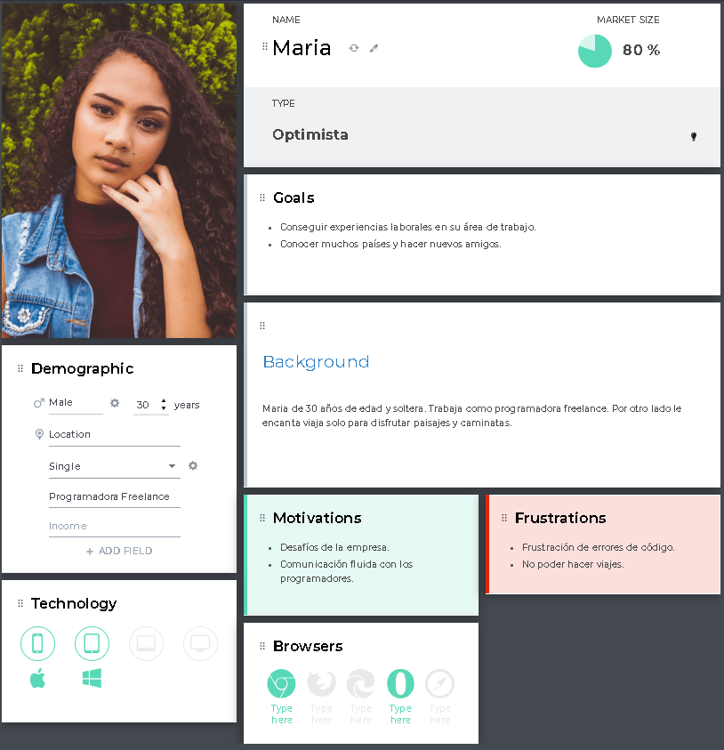

- **Segmento objetivo: Proveedor turístico sostenible**
  
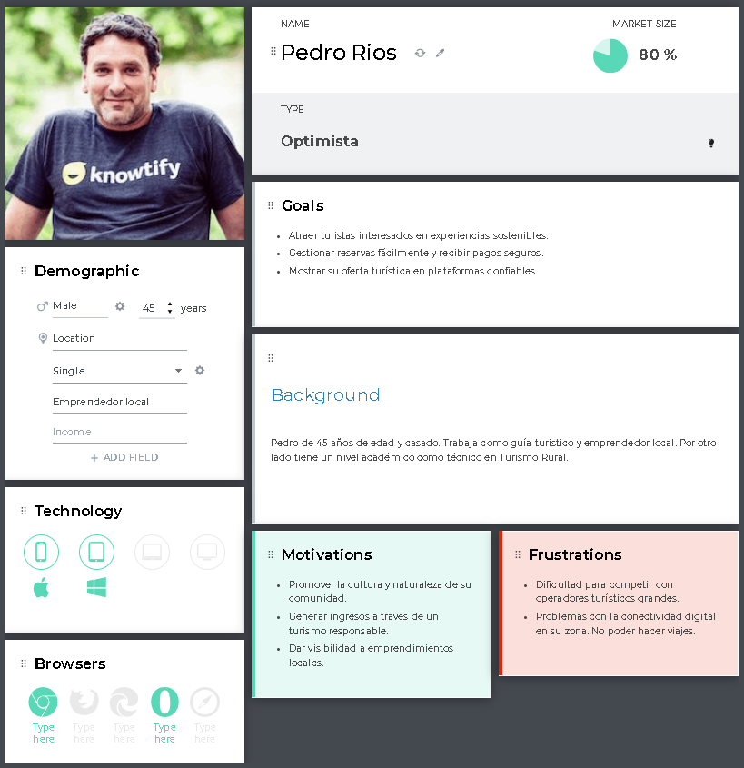

###  2.3.2. User Task Matrix

En esta sección se presenta el User Task Matrix, una herramienta centrada en nuestros dos segmentos objetivos principales: el Turista Responsable y el Proveedor Turístico Sostenible. Esta matriz permite identificar y comparar las tareas clave que cada usuario realiza o espera realizar en la plataforma.

<table border="1" cellspacing="0" cellpadding="8">
  <tr>
    <th><b><i>User Task Matrix</i></b></th>
    <th><b><i>Lucía (Turista Responsable)</i></b></th>
    <th><b><i>Pedro (Proveedor Turístico)</i></b></th>
  </tr>
  <tr>
    <td>Buscar experiencias sostenibles</td>
    <td style="text-align: center;"><i>Alta</i></td>
    <td style="text-align: center;"><i>No aplica</i></td>
  </tr>
  <tr>
    <td>Filtrar experiencias por ubicación/interés</td>
    <td style="text-align: center;"><i>Alta</i></td>
    <td style="text-align: center;"><i>No aplica</i></td>
  </tr>
  <tr>
    <td>Ver perfil y calificaciones del proveedor</td>
    <td style="text-align: center;"><i>Media</i></td>
    <td style="text-align: center;"><i>No aplica</i></td>
  </tr>
  <tr>
    <td>Reservar una experiencia</td>
    <td style="text-align: center;"><i>Alta</i></td>
    <td style="text-align: center;"><i>No aplica</i></td>
  </tr>
  <tr>
    <td>Crear y publicar una experiencia</td>
    <td style="text-align: center;"><i>No aplica</i></td>
    <td style="text-align: center;"><i>Alta</i></td>
  </tr>
  <tr>
    <td>Gestionar reservas recibidas</td>
    <td style="text-align: center;"><i>No aplica</i></td>
    <td style="text-align: center;"><i>Alta</i></td>
  </tr>
  <tr>
    <td>Recibir pagos por experiencias</td>
    <td style="text-align: center;"><i>No aplica</i></td>
    <td style="text-align: center;"><i>Alta</i></td>
  </tr>
  <tr>
    <td>Editar información de su perfil</td>
    <td style="text-align: center;"><i>Media</i></td>
    <td style="text-align: center;"><i>Media</i></td>
  </tr>
  <tr>
    <td>Chatear con otros usuarios</td>
    <td style="text-align: center;"><i>Media</i></td>
    <td style="text-align: center;"><i>Media</i></td>
  </tr>
  <tr>
    <td>Calificar experiencias</td>
    <td style="text-align: center;"><i>Alta</i></td>
    <td style="text-align: center;"><i>Baja</i></td>
  </tr>
  <tr>
    <td>Acceder a soporte o ayuda</td>
    <td style="text-align: center;"><i>Media</i></td>
    <td style="text-align: center;"><i>Media</i></td>
  </tr>
</table>

Esta clasificación facilita la priorización de características durante la construcción del Product Backlog, asegurando que se enfoquen primero las funcionalidades más relevantes para cada tipo de usuario. Además, el análisis comparativo permite visualizar las similitudes, diferencias, y oportunidades entre ambos perfiles.

###  2.3.3. User Journey Mapping

En esta sección, se describen en detalle los User Journey Mapping para dos perfiles distintos de usuarios de la plataforma de turismo responsable: los Turistas Ocasionales y los Turistas Frecuentes. Estos mapas proporcionan una visión integral del recorrido que cada tipo de usuario realiza dentro del sistema, desde el primer contacto con la plataforma hasta su uso habitual y su interacción continua con las funcionalidades ofrecidas. Se destacan las etapas clave, las emociones y necesidades específicas de cada usuario, para asegurar una comprensión clara de su experiencia global.

*Para Turista Responsable* 
- El recorrido de Lucía comienza motivado por su interés en descubrir experiencias sostenibles, auténticas y respetuosas con el entorno local. Su primer contacto con la plataforma suele darse a través de búsquedas en Google, recomendaciones de amigos o redes sociales.

- Una vez en la plataforma, explora experiencias disponibles, filtra por destino e impacto ambiental, y se registra para poder reservar. Lucía valora una navegación clara y confiable, con información transparente sobre sostenibilidad, seguridad y beneficios locales.
  
- Tras reservar y vivir la experiencia, suele dejar una reseña, evaluar al proveedor y, si su experiencia fue positiva, volver a utilizar la plataforma en futuros viajes. También le interesa guardar tours y recibir recomendaciones personalizadas según sus intereses.

*Para Proveedor Turístico Sostenible*
- El viaje de Pedro inicia cuando busca una forma de dar visibilidad a sus experiencias locales sin intermediarios tradicionales. Descubre la plataforma a través de un correo de invitación, recomendación de otro proveedor o una publicación en redes profesionales.
  
- Se registra y configura su perfil de proveedor. Publica sus experiencias detallando impacto social, logístico y ambiental. Necesita un panel sencillo para subir fotos, definir precios y gestionar reservas.
  
- Una vez que los turistas comienzan a reservar, Pedro gestiona la disponibilidad, responde consultas y organiza la logística. Después del tour, revisa las reseñas y ajusta su oferta según los comentarios. Busca construir una reputación confiable, ya que esto influye directamente en su visibilidad dentro de la plataforma.

Aunque tienen objetivos distintos, ambos comparten una motivación común: participar activamente en un turismo más consciente, auténtico y sostenible. Sus recorridos reflejan roles complementarios dentro del ecosistema de la plataforma.

- #### *Turista Responsable*
| Etapa                         | Acción del usuario (Turista ocasional)       | Emoción         | Canal                       | Oportunidad de mejora                           |
|------------------------------|----------------------------------------------|-----------------|-----------------------------|------------------------------------------------|
| Descubrimiento               | Encuentra la plataforma por redes o buscador | Curiosidad      | Web, redes sociales         | Mejorar posicionamiento SEO y contenido visual |
| Registro                     | Se registra para ver detalles de un tour     | Interés         | Página web                  | Simplificar el proceso de registro             |
| Exploración                  | Navega tours sin un objetivo claro           | Confusión       | Navegador                   | Sugerencias iniciales según localización       |
| Reserva                      | Selecciona y reserva un tour                 | Satisfacción    | Página de reservas          | Ofrecer asistencia en tiempo real              |
| Participación en el tour     | Asiste a la actividad                        | Entusiasmo      | Presencial                  | Recordatorios y checklist antes del tour       |
| Post-experiencia             | Puede dejar una reseña o no                  | Desconexión     | Email, web                  | Incentivar feedback con recompensas            |

- #### *Proveedor Turístico Sostenible*
| Etapa                         | Acción del usuario (Turista frecuente)       | Emoción         | Canal                       | Oportunidad de mejora                           |
|------------------------------|----------------------------------------------|-----------------|-----------------------------|------------------------------------------------|
| Descubrimiento               | Conoce la plataforma a través de otros guías, redes o invitaciones    | EntusCuriosidad, escepticismoasmo      | Facebook, WhatsApp, web                   | Campañas de captación con testimonios de otros proveedores                   |
| Registro                     | Se registra como proveedor, completa perfil y verifica identidad                                | Motivación, dudas técnicas       | Formulario, email de verificación                    | Proceso guiado, soporte en línea, validación rápida            |
| Publicación                  | Crea y publica una experiencia con fotos, texto y precio       | Creatividad, expectativa       | Dashboard proveedor             | Asistente de publicación, plantillas prediseñadas     |
| Gestión                      | Recibe reservas, responde dudas, organiza logística del tour                     | Organización, estrés  | Panel de reservas, mensajería                 | Sistema de alertas, app móvil para gestión rápida              |
| Entrega del tour     | Da la experiencia presencialmente                    | Entusiasmo      | WhatsApp, en persona                  | Confirmación previa, herramientas de check-in         |
| Retención          | Publica nuevas experiencias, busca subir su reputación           | Motivación, compromiso      | Email, plataforma           | Enviar reportes de desempeño, sugerencias automáticas            |

###  2.3.4. Empathy Mapping

En esta sección se presenta el Empathy Mapping, una herramienta esencial para construir perfiles detallados de los dos principales user personas de la plataforma: Lucía, Turista Responsable, y Pedro, Proveedor Turístico Sostenible.

El objetivo es comprender de forma profunda sus pensamientos, emociones, comportamientos y motivaciones al interactuar con la plataforma. Para ello, se analiza lo que cada usuario ve, oye, dice, hace y siente, además de identificar sus dolores (pains) y beneficios esperados (gains).

Este ejercicio permite empatizar con sus contextos reales, facilitando el diseño de funcionalidades centradas en las verdaderas necesidades de cada segmento.

- **Segmento: Turista Responsable**

| Etapa                | Registro                           | Búsqueda de tours                           | Reserva                                   | Experiencia del tour                 | Revisión y seguimiento                   |
| -------------------- | ---------------------------------- | ------------------------------------------- | ----------------------------------------- | ------------------------------------ | ---------------------------------------- |
| **User goals**       | Acceder sin complicaciones         | Encontrar opciones auténticas y sostenibles | Reservar sin repetir pasos                | Vivir una experiencia local única    | Compartir su experiencia y evaluar       |
| **Touchpoints**      | Formulario simple, login social    | Buscador con filtros y etiquetas            | Pasarela intuitiva, historial de reservas | Confirmaciones, contacto con guía    | Email post-tour, botón para dejar reseña |
| **Customer Thought** | “Quiero empezar sin perder tiempo” | “¿Qué lugares realmente valen la pena?”     | “¿Mi pago está protegido?”                | “¿Será como lo prometieron?”         | “¿Cómo ayudo a otros viajeros como yo?”  |
| **Experience**       | 🙂 Fluida y amigable               | 🙂 Interesante y consciente                 | 😄 Confiable y directa                    | 😄 Auténtica y enriquecedora         | 😄 Gratificante y útil                   |
| **Ideas/Opps**       | Autocompletar desde Gmail          | Etiquetas como ‘eco-friendly’, ‘local’      | Pago en un clic con billetera digital     | Asistente virtual para dudas rápidas | Recompensa por dejar reseñas             |

- **Segmento: Proveedor Turístico Sostenible**

| Etapa                | Registro                             | Publicación de tour                  | Gestión de reservas                   | Ejecución del tour                      | Evaluación y continuidad                  |
| -------------------- | ------------------------------------ | ------------------------------------ | ------------------------------------- | --------------------------------------- | ----------------------------------------- |
| **User goals**       | Registrar su oferta fácilmente       | Describir su tour de forma atractiva | Organizar sin errores ni olvidos      | Dar una experiencia memorable y segura  | Recibir feedback, mejorar y seguir activo |
| **Touchpoints**      | Registro con ayuda paso a paso       | Panel con plantilla de tours         | Calendario, notificaciones, chat      | Checklist del día, contacto con turista | Plataforma de evaluación, estadísticas    |
| **Customer Thought** | “¿Será complicado llenar todo esto?” | “¿Mi tour llama la atención?”        | “¿Todo está confirmado y claro?”      | “¿Los turistas estarán satisfechos?”    | “¿Estoy creciendo en la plataforma?”      |
| **Experience**       | 🙂 Simple y bien guiada              | 🙂 Creativa pero necesita apoyo      | 🙂 Organizada y clara                 | 😄 Profesional y con buen feedback      | 😄 Motivadora y constructiva              |
| **Ideas/Opps**       | Tutorial interactivo                 | Asistente para redacción atractiva   | App móvil para gestión en tiempo real | Confirmación de llegada del turista     | Tips automáticos para mejorar perfil      |

###  2.3.5. As-is Scenario Mapping
En esta sección se presenta el As-Is Scenario Mapping para cada uno de los segmentos objetivos identificados: Turista Responsable y Proveedor Turístico Sostenible. Este análisis tiene como objetivo visualizar cómo estos usuarios interactúan actualmente con plataformas digitales al planificar, ofrecer o reservar experiencias de viaje, y así detectar oportunidades de mejora, frustraciones comunes y necesidades no cubiertas.

Para este mapeo se han considerado cinco fases clave del recorrido del usuario: Descubrimiento, Evaluación, Reserva, Experiencia y Seguimiento. En cada etapa se identifican acciones típicas, aspectos positivos, dificultades experimentadas y oportunidades que pueden guiar el diseño de funcionalidades relevantes para nuestra plataforma de turismo responsable.

El análisis se basa en entrevistas y observaciones realizadas durante la fase de investigación, complementadas con supuestos validados por referencias externas, permitiendo entender el contexto actual y orientar decisiones estratégicas centradas en el usuario.

*As-is Scenario mapping: Turista Responsable*
  
  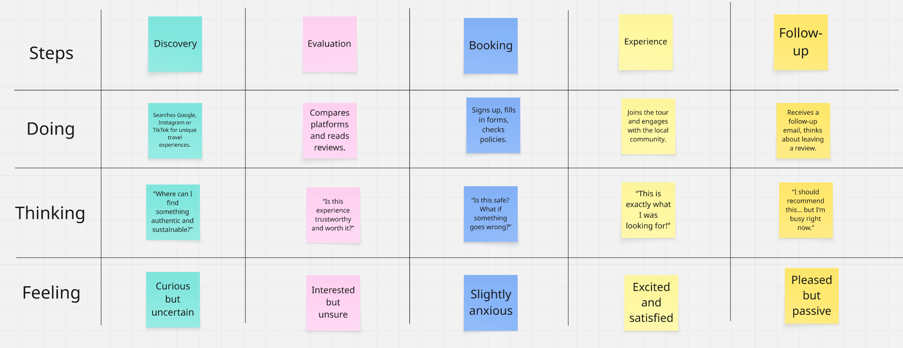

*As-is Scenario mapping: Proveedor Turístico Sostenible*
  
  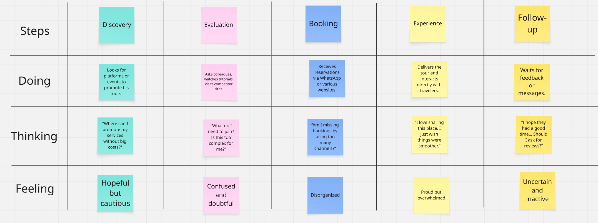

### Capítulo III: Requirements Specification

3.1. To-Be Scenario Mapping.

En esta sección se presenta el *To-Be Scenario Mapping* para cada uno de los segmentos de usuarios identificados: **Turistas Responsables** y **Proveedores Turísticos Sostenibles**. Este análisis tiene como objetivo visualizar cómo se transformaría la experiencia de estos usuarios al utilizar **EcoTrip**, una plataforma digital enfocada en la planificación y reserva de experiencias de viaje sostenibles.

A través del uso de EcoTrip, se busca mejorar los puntos de dolor detectados en el As-Is Scenario Mapping, ofreciendo una experiencia más intuitiva, informada y alineada con valores de responsabilidad ambiental y sostenibilidad. El mapeo considera los cambios clave que esta nueva solución podría aportar en términos de comportamiento, pensamiento y emociones de los usuarios.

El proceso de elaboración del To-Be Scenario Mapping siguió las siguientes etapas:

- **Preparación:** Revisión de los insights obtenidos del As-Is Scenario Mapping.
- **Lluvia de ideas individual:** Identificación de posibles soluciones y mejoras centradas en el usuario.
- **Revisión e identificación de fases:** Se mantuvieron las mismas fases empleadas en el análisis As-Is para asegurar comparabilidad.
- **Comparación con el As-Is:** Se contrastó con el escenario actual para identificar mejoras concretas, tanto funcionales como emocionales.

Las fases consideradas en este análisis son: **Descubrimiento, Evaluación, Reserva, Experiencia y Seguimiento.**

#### To-Be Scenario Mapping – Turistas Responsables

#### To-Be Scenario Mapping – Proveedores Turísticos Sostenibles

3.2. User Stories.

En esta sección se presentan las User Stories desarrolladas para el proyecto EcoTrip, una plataforma digital orientada al turismo sostenible. Las historias están elaboradas en base a los perfiles identificados en el To-Be Scenario Mapping: Turistas Frecuentes y Turistas Ocasionales.

Cada historia refleja una necesidad concreta de los usuarios y está asociada a una funcionalidad clave del sistema. Asimismo, se incluyen los criterios de aceptación formulados en formato Gherkin, con tres escenarios por historia, lo cual permite validar de manera precisa y completa si una funcionalidad cumple con los requisitos del usuario. Esta estructura facilita la planificación ágil del desarrollo y asegura el alineamiento entre el equipo de diseño, desarrollo y las expectativas de los usuarios.

Epics: 

| **Epic ID** | **Título**                 | **Descripción**                                                                                                                                       | **Segmento Objetivo**                       |
|-------------|---------------------------|------------------------------------------------------------------------------------------------------------------------------------------------------|--------------------------------------------|
| EP-01       | Explorar experiencias     | Como turista responsable, quiero ver experiencias sostenibles para saber qué ofrece EcoTrip.                                                         | Turistas responsables                      |
| EP-02       | Registro de proveedores   | Como proveedor turístico sostenible, quiero registrarme para ofrecer mis servicios turísticos en la plataforma.                                      | Proveedores turísticos sostenibles         |
| EP-03       | Crear plan                | Como turista responsable, quiero crear mi propio plan de viaje con actividades y hospedajes sostenibles.                                             | Turistas responsables                      |
| EP-04       | Conexión con guías        | Como turista responsable, quiero contactar guías que hablen mi idioma para enriquecer mi experiencia.                                                | Turistas responsables                      |
| EP-05       | Reservas y pagos          | Como turista responsable, quiero reservar experiencias y pagar fácilmente para confirmar mi participación.                                           | Turistas responsables                      |
| EP-06       | Página informativa        | Como turista responsable, quiero saber qué es EcoTrip y qué servicios ofrece para decidir si usar la plataforma.                                     | Turistas responsables                      |
| EP-07       | Gestión de favoritos      | Como turista responsable, quiero poder marcar experiencias como favoritas para consultarlas después.                                                | Turistas responsables                      |
| EP-08       | Validación de formularios | Como proveedor turístico sostenible, quiero que todos los formularios tengan validación para evitar errores en el registro o actualizaciones.        | Proveedores turísticos sostenibles         |
| EP-09       | Notificaciones visuales   | Como usuario (turista o proveedor), quiero recibir mensajes visuales para saber qué acciones fueron exitosas o fallidas.                            | Ambos segmentos                            |
| EP-10       | Personalización del perfil| Como usuario (turista o proveedor), quiero personalizar mi perfil con datos e intereses para mejorar mi experiencia en la plataforma.                | Ambos segmentos                            |
| EP-11       | Accesibilidad y UX        | Como usuario (turista o proveedor), quiero que el sitio sea accesible y cómodo para navegar en cualquier dispositivo.                               | Ambos segmentos    

User Stories: 

| **User Story ID** | **Título** | **Descripción (Segmento Objetivo)** | **Criterios de Aceptación (Gherkin)** | **Relacionado con (Epic ID)** |
|-------------------|------------|-------------------------------------|----------------------------------------|-------------------------------|
| US-01 | Filtrar experiencias | Como turista responsable, quiero filtrar por tipo de experiencia para encontrar lo que me interesa. | **Escenario 1:** **Given** que estoy viendo las experiencias **When** selecciono “Voluntariado” **Then** solo se muestran experiencias de voluntariado. **Escenario 2:** **Given** que ya he filtrado **When** regreso a la lista **Then** el filtro se mantiene aplicado. **Escenario 3:** **Given** que selecciono varios tipos **When** aplico los filtros **Then** se actualiza la lista combinada. | EP-01 |
| US-02 | Aprobación de proveedor | Como administrador, quiero revisar los datos del proveedor turístico sostenible para aprobar o rechazar su ingreso. | **Escenario 1:** **Given** que hay una solicitud nueva **When** reviso los documentos **Then** puedo aprobarla. **Escenario 2:** **Given** que detecto errores **When** rechazo la solicitud **Then** puedo escribir una razón y notificar. **Escenario 3:** **Given** que apruebo **When** finalizo el proceso **Then** se actualiza a “Proveedor Activo”. | EP-02 |
| US-03 | Recomendaciones para itinerario | Como turista responsable, quiero recibir sugerencias basadas en mis gustos. | **Escenario 1:** **Given** que completé mi perfil **When** ingreso a recomendaciones **Then** veo actividades sugeridas. **Escenario 2:** **Given** que no me gustan **When** marco “No me interesa” **Then** se actualiza la lista. **Escenario 3:** **Given** que acepto **When** agrego al itinerario **Then** aparece en mi plan. | EP-03 |
| US-04 | Reservar guía específico | Como turista responsable, quiero reservar a un guía específico que hable mi idioma. | **Escenario 1:** **Given** que encontré un guía **When** elijo una fecha **Then** hago la reserva. **Escenario 2:** **Given** que reservé **When** reviso mi perfil **Then** veo el historial. **Escenario 3:** **Given** que el guía confirma **When** recibo el correo **Then** veo detalles del encuentro. | EP-04 |
| US-05 | Cancelar reserva | Como turista responsable, quiero cancelar una reserva si no puedo asistir. | **Escenario 1:** **Given** que tengo una reserva **When** accedo a ella **Then** veo la opción cancelar. **Escenario 2:** **Given** que cancelo a tiempo **When** aplico la acción **Then** recibo reembolso. **Escenario 3:** **Given** que se cancela **When** reviso correo **Then** veo confirmación. | EP-05 |
| US-06 | Ver testimonios | Como turista responsable, quiero leer opiniones de otros para confiar en la plataforma. | **Escenario 1:** **Given** que entro a testimonios **When** veo las opiniones **Then** muestran nombre, experiencia y calificación. **Escenario 2:** **Given** que busco algo específico **When** uso filtro **Then** veo testimonios relevantes. **Escenario 3:** **Given** que leo un testimonio **When** me parece útil **Then** puedo marcarlo como “útil”. | EP-06 |
| US-07 | Marcar experiencia como favorita | Como turista responsable, quiero marcar experiencias como favoritas para guardarlas y verlas luego. | **Escenario 1:** **Given** que veo una experiencia **When** hago clic en corazón **Then** se guarda como favorita. **Escenario 2:** **Given** que estoy en mi perfil **When** entro a favoritos **Then** veo lista guardada. **Escenario 3:** **Given** que quito una experiencia **When** hago clic otra vez **Then** se elimina de favoritos. | EP-07 |
| US-08 | Validar campos obligatorios | Como proveedor turístico sostenible, quiero validaciones en los formularios para no enviar datos incompletos. | **Escenario 1:** **Given** que lleno un formulario **When** dejo un campo vacío **Then** veo error. **Escenario 2:** **Given** que pongo un correo inválido **When** intento enviar **Then** veo advertencia. **Escenario 3:** **Given** que corrijo **When** vuelvo a intentar **Then** se envía correctamente. | EP-08 |
| US-09 | Mostrar alertas visuales | Como usuario (turista o proveedor), quiero ver alertas (toasts) al realizar acciones importantes. | **Escenario 1:** **Given** que agrego experiencia **When** confirmo acción **Then** aparece toast de éxito. **Escenario 2:** **Given** que cancelo reserva **When** confirmo cancelación **Then** veo mensaje de confirmación. **Escenario 3:** **Given** que ocurre un error **When** realizo acción **Then** veo mensaje de error. | EP-09 |
| US-10 | Editar foto de perfil | Como usuario (turista o proveedor), quiero subir o cambiar mi foto de perfil. | **Escenario 1:** **Given** que estoy en perfil **When** hago clic en “Cambiar foto” **Then** selecciono imagen. **Escenario 2:** **Given** que subo imagen válida **When** guardo **Then** se actualiza foto. **Escenario 3:** **Given** que intento archivo no permitido **When** lo subo **Then** veo error. | EP-10 |
| US-11 | Activar modo oscuro | Como usuario (turista o proveedor), quiero activar modo oscuro para una experiencia visual cómoda. | **Escenario 1:** **Given** que estoy en cualquier página **When** activo switch modo oscuro **Then** interfaz cambia. **Escenario 2:** **Given** que cierro sesión **When** vuelvo a ingresar **Then** modo oscuro sigue activo. **Escenario 3:** **Given** que desactivo modo oscuro **When** hago clic en switch **Then** vuelve al modo claro. | EP-11 |

3.3. Impact Mapping.

#### Mapa de segmento turistas responsable:

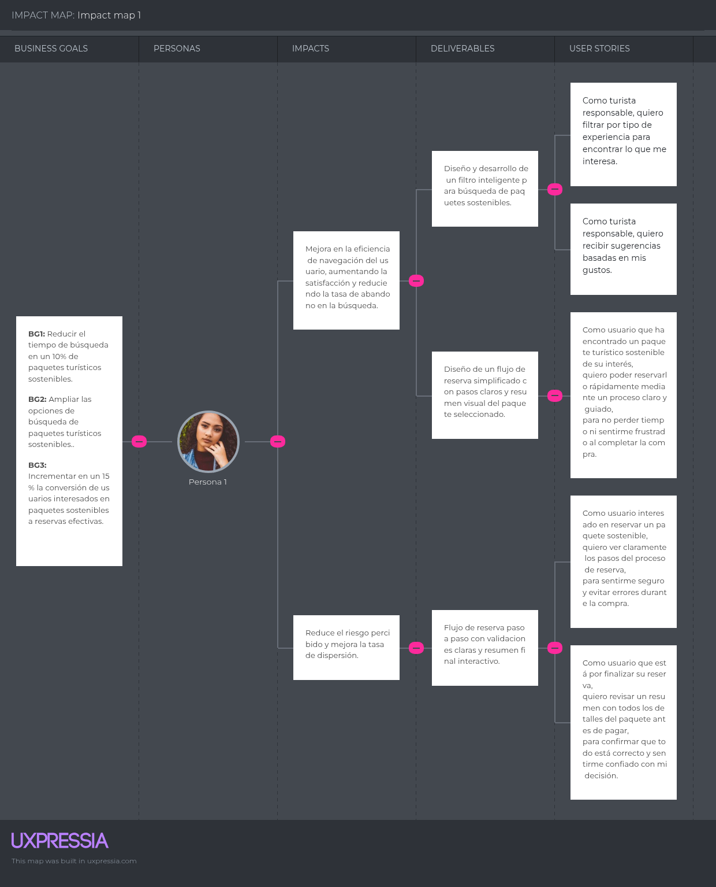

#### Mapa de segmento proveedores turisticos ecologicos:

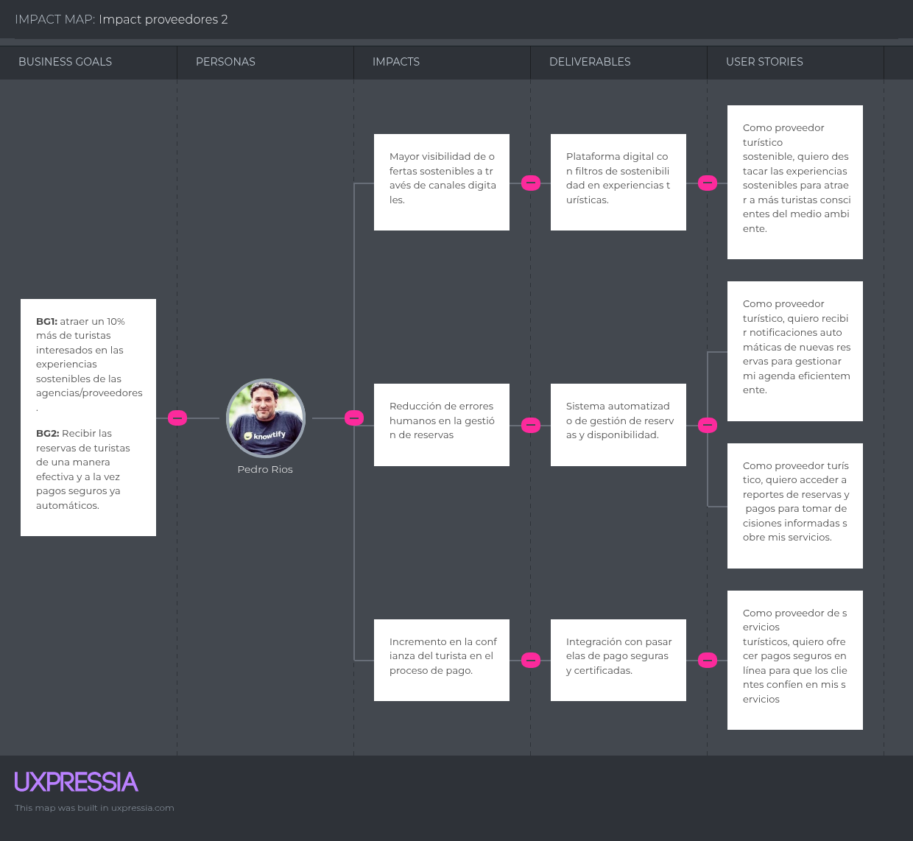

3.4. Product Backlog.

| ID      | Título                                         | Puntaje (2,3,5,8) | Descripción                                                                                    |
| ------- | ---------------------------------------------- | --------- | ---------------------------------------------------------------------------------------------- |
| US-01   | Ver lista de experiencias sostenibles          | 8    | Como turista ocasional quiero ver una lista de experiencias para explorar qué ofrece EcoTrip.  |
| US-01.1 | Filtrar experiencias por tipo                  | 8      | Como turista frecuente quiero filtrar experiencias por tipo para encontrar lo que me interesa. |
| US-02   | Registro de proveedores                        | 5      | Como proveedor quiero registrarme para ofrecer mis servicios turísticos sostenibles.           |
| US-02.1 | Aprobación de proveedor                        | 5     | Como administrador quiero revisar y aprobar solicitudes de proveedores.                        |
| US-03   | Crear plan de viaje personalizado              | 5    | Como turista frecuente quiero armar mi propio itinerario con actividades y hospedajes.         |
| US-03.1 | Sugerencias de itinerario basadas en intereses | 5     | Como turista ocasional quiero recibir sugerencias de actividades según mi perfil.              |
| US-04   | Conexión con guías turísticos                  | 8      | Como turista frecuente quiero contactar guías que hablen mi idioma.                            |
| US-04.1 | Reservar guía específico                       | 3   | Como turista ocasional quiero poder reservar a un guía en específico.                          |
| US-05   | Reservar y pagar experiencias                  | 5     | Como turista frecuente quiero reservar y pagar actividades de manera fácil.                    |
| US-05.1 | Cancelar reserva y recibir reembolso           | 3     | Como turista ocasional quiero cancelar mi reserva si no podré asistir.                         |
| US-06   | Página informativa sobre EcoTrip               | 3    | Como visitante quiero saber qué es EcoTrip y qué servicios ofrece.                             |
| US-06.1 | Ver testimonios de otros viajeros              | 2      | Como visitante quiero leer opiniones para confiar en la plataforma.                            |
| US-07   | Gestión del portafolio de proveedores          | 5     | Como proveedor quiero agregar, editar o eliminar mis experiencias.                             |
| US-08   | Mejorar visibilidad de proveedores             | 8     | Como proveedor quiero mostrar mis calificaciones y reseñas públicas.                           |
| US-09   | Registro y validación fácil para proveedores   | 5     | Como proveedor quiero un proceso de registro rápido y sencillo.                                |
| US-10   | Recibir pagos seguros como proveedor           | 8     | Como proveedor quiero recibir mis pagos de manera segura y poder ver mi historial.             |

### Capítulo IV: Product Design

4.1. Style Guidelines.

Con el objetivo de asegurar coherencia visual y comunicacional a lo largo de todos los puntos de contacto con los usuarios, se define una guía de estilo centralizada para el equipo de diseño y desarrollo. Esta guía permitirá mantener una presentación consistente tanto en plataformas web como móviles, alineada con los valores de sostenibilidad, inclusión y responsabilidad promovidos por EcoTrip.

4.1.1. General Style Guidelines.

Aquí se explica las decisiones y referencias visuales sobre conceptos generales básicos como Branding, Typography, Colors y Spacing, así como las dimensiones a adoptar para el tono de comunicación y lenguaje aplicado (Divertido/Serio, Formal/Casual, Respetuoso/Irreverente, Entusiasta/Sereno). Puede tomarse como referencia un Design System existente, sobre el cual se puede realizar adaptaciones.

#### Branding

EcoTrip comunica sostenibilidad, autenticidad y conexión con la naturaleza. Su identidad visual transmite cercanía, confianza y respeto cultural. El logotipo utiliza una tipografía moderna y amigable, evocando caminos y hojas que representan el viaje y la ecología.

#### Typography

Se utilizan fuentes limpias y legibles:

- **Primaria:** _Poppins_ – utilizada para títulos y navegación, aporta modernidad y claridad.
- **Secundaria:** _Open Sans_ – aplicada en cuerpos de texto, facilita la lectura prolongada.

Ambas fuentes están disponibles en Google Fonts, lo que facilita su integración en entornos web y móviles.

#### Colors

La paleta de colores se inspira en la naturaleza, transmitiendo calma y responsabilidad ambiental:

- **Verde Bosque (#4CAF50):** color principal que representa sostenibilidad y acción responsable.
- **Verde Lima (#C5E1A5):** secundario, aporta energía y frescura.
- **Beige Tierra (#FFF8E1):** fondo neutro y cálido, amigable a la vista.
- **Gris Suave (#757575):** utilizado en textos secundarios o de soporte.
- **Blanco (#FFFFFF):** proporciona limpieza visual y contraste.

#### Spacing

Se define una escala modular de espaciado basada en múltiplos de 8px (8, 16, 24, 32, etc.), lo cual facilita la organización de layouts consistentes y balanceados visualmente.

#### Tono y Lenguaje

EcoTrip adopta un lenguaje accesible y empático:

- **Tono:** cercano, optimista y comprometido con el usuario.
- **Lenguaje:**
  - Entre **casual y respetuoso**, evitando tecnicismos innecesarios.
  - **Entusiasta**, pero no invasivo.
  - Inspirador y culturalmente sensible, especialmente en interacciones con comunidades locales.

**Ejemplo de voz:**

- ✅ “¿Listo para vivir una experiencia inolvidable en la selva amazónica?”
- ❌ “Reserva ya o te lo pierdes.”

---

4.1.2. Web Style Guidelines.

En esta sección se explica e ilustra las decisiones sobre los estándares visuales y de interacción para responsive web interfaces.

#### Diseño Responsive

EcoTrip utiliza un diseño adaptable que se ajusta a distintos dispositivos: computadoras, tablets y smartphones, manteniendo la coherencia visual.

#### Botones

- Forma: redondeados (12px de radio).
- Colores: uso del verde principal (#4CAF50) con texto blanco.
- Estados: `hover`, `active` y `disabled` definidos claramente.
- Iconografía: acompañados de íconos solo cuando añaden significado.

#### Navegación

- Barra superior fija con logo alineado a la izquierda.
- Enlaces principales: “Explorar”, “Mi Plan”, “Perfil”.
- Comportamiento: la barra cambia de color ligeramente al hacer scroll.

#### Accesibilidad

- Contraste de color superior a 4.5:1.
- Tipografía escalable sin romper diseño.
- Navegación con teclado y etiquetas `aria-label` para elementos interactivos.

#### Animaciones

- Transiciones suaves entre secciones (`0.3s a 0.5s`).
- Efectos sutiles de entrada y desplazamiento en los elementos clave.
- Sin uso excesivo de animaciones para no afectar el rendimiento ni distraer al usuario.

#### Sustento de diseño

Se toman como referencia principios del **Material Design** de Google y el sistema de diseño de **Airbnb**, por su enfoque en experiencias culturales, accesibilidad y claridad visual. Además, se adaptan las guías al contexto de turismo sostenible, garantizando:

- **Consistencia** visual entre pantallas.
- **Escalabilidad** del diseño a nuevas funcionalidades.
- **Usabilidad** y accesibilidad para todo tipo de usuarios.

---

4.2. Information Architecture.

En esta sección se definen las decisiones de arquitectura de información que dirigen cómo se organizará el contenido en las experiencias web de **EcoTrip**, incluyendo el Landing Page y futuras aplicaciones. El objetivo principal es garantizar que los visitantes y usuarios se adapten de manera intuitiva a la funcionalidad de cada producto, puedan encontrar fácilmente lo que necesitan y logren una navegación fluida y satisfactoria.

Las propuestas de arquitectura están diseñadas siguiendo principios de usabilidad, claridad y accesibilidad, abordando los siguientes componentes:

- **Organization Systems**
- **Labeling Systems**
- **SEO Tags and Meta Tags**
- **Searching Systems**
- **Navigation Systems**

  4.2.1. Organization Systems.

Se establecen las siguientes decisiones sobre la organización del contenido:

#### Visual Hierarchy

Se aplicará una **jerarquía visual clara** en todas las páginas, priorizando:

- **Primero:** Secciones principales como "Explorar", "Mi Plan", "Reservas".
- **Luego:** Subcategorías como tipos de experiencias (Voluntariado, Ecotours, Aventura).
- **Finalmente:** Información detallada de cada actividad o guía.

El tamaño, color y peso de los elementos gráficos ayudarán a guiar la atención del usuario hacia lo más relevante.

#### Secuencial Organization

En procesos como:

- **Registro de Proveedores**
- **Creación de Itinerarios Personalizados**
- **Proceso de Reserva**

Se utilizará una organización **secuencial paso a paso**, facilitando al usuario completar acciones en un orden lógico y guiado.

Ejemplo de pasos en creación de itinerario:

1. Seleccionar actividades.
2. Escoger hospedaje.
3. Confirmar transporte.
4. Guardar y visualizar el plan.

#### Matricial Organization

Para listas de experiencias o actividades disponibles, se aplicará un modelo **matricial**, donde el usuario puede comparar varias opciones al mismo nivel mediante filtros (por precio, popularidad, impacto ambiental, tipo de actividad).

---

#### Esquemas de Categorización

Según el tipo de contenido, se emplearán:

- **Por tópicos:** experiencias agrupadas en categorías como "Aventura", "Cultural", "Voluntariado", "Ecológico".
- **Según audiencia:** filtrado de experiencias recomendadas para "Turistas Frecuentes" y "Turistas Ocasionales".
- **Cronológico:** para visualizar actividades próximas a realizarse (eventos en fechas específicas).
- **Alfabético:** listado de proveedores o guías por nombre, en catálogos extensos.

Estos esquemas permiten un acceso eficiente y adaptado a diferentes formas de búsqueda del usuario.

---

4.2.2. Labeling Systems.

La representación de los datos en la plataforma busca ser clara, intuitiva y evitar confusión. Para ello se establecen las siguientes directrices de etiquetado:

#### 🔹 Principios de Etiquetado

- Utilizar un **mínimo número de palabras**.
- Preferir términos **comunes** y **fáciles de comprender**.
- Mantener **consistencia** en la terminología a lo largo del sitio.

#### 🔹 Etiquetas principales propuestas

| Área                    | Etiqueta asignada          | Propósito                           |
| ----------------------- | -------------------------- | ----------------------------------- |
| Exploración             | "Explorar"                 | Navegar entre experiencias.         |
| Planificación           | "Mi Plan"                  | Acceso al itinerario personalizado. |
| Reservas                | "Mis Reservas"             | Historial de reservas confirmadas.  |
| Registro de Proveedores | "Conviértete en proveedor" | Registro de nuevos servicios.       |
| Búsqueda                | "Buscar experiencias"      | Entrada de texto para buscar.       |
| Perfil                  | "Mi Perfil"                | Datos personales del usuario.       |

Además, las etiquetas dentro de los filtros utilizarán palabras clave simples como:

- "Tipo de experiencia"
- "Duración"
- "Nivel de impacto ecológico"
- "Idioma del guía"

Esto facilita al usuario la interpretación inmediata de las opciones disponibles.

---

4.2.3. SEO Tags and Meta Tags

Para optimizar la visibilidad y accesibilidad de EcoTrip en motores de búsqueda, se establecen los siguientes **SEO Tags** y **Meta Tags** que serán implementados tanto en el **Landing Page** como en la **Web Application**:

| Página                           | Title                                            | Meta Description                                                                                | Meta Keywords                                                         | Author         |
| -------------------------------- | ------------------------------------------------ | ----------------------------------------------------------------------------------------------- | --------------------------------------------------------------------- | -------------- |
| Landing Page                     | EcoTrip - Vive Experiencias Sostenibles          | Descubre y reserva experiencias de turismo ecológico auténtico alrededor del mundo con EcoTrip. | ecoturismo, turismo sostenible, experiencias eco, viajes responsables | Equipo EcoTrip |
| Web Application - Home           | EcoTrip App - Tu Viaje Responsable Comienza Aquí | Organiza, personaliza y reserva experiencias sostenibles de forma sencilla y segura.            | crear itinerario ecológico, plan de viaje sostenible, actividades eco | Equipo EcoTrip |
| Web Application - Perfil Usuario | EcoTrip - Mi Perfil                              | Gestiona tus datos, itinerarios y reservas ecológicas en EcoTrip.                               | perfil usuario EcoTrip, reservas turismo ecológico                    | Equipo EcoTrip |

4.2.4. Searching Systems.

Para mejorar la capacidad de búsqueda dentro del sitio y aplicación, se implementarán sistemas de búsqueda claros y efectivos.

#### Tipos de búsqueda ofrecidos

- **Búsqueda Global (Header Search Box):**

  - Visible en todas las páginas principales.
  - Permite buscar experiencias, guías o categorías.
  - Autocompletado con sugerencias relevantes.

- **Filtros de búsqueda en "Explorar experiencias":**

  - **Tipo de experiencia** (Voluntariado, Ecotour, Aventura, Cultura).
  - **Duración** (1 día, 2-5 días, +7 días).
  - **Nivel de impacto ecológico** (Certificado eco, Responsable, Sugerido).
  - **Ubicación** (continente, país o región).
  - **Idioma del guía**.

- **Búsqueda específica en el perfil de proveedores:**
  - Por nombre del proveedor.
  - Por calificación de usuarios.

#### Presentación de resultados

- **Resultados dinámicos:** a medida que se aplica un filtro o búsqueda, el listado se actualiza en tiempo real.
- **Organización matricial:** los resultados se mostrarán en tarjetas (cards) que incluyen:

  - Imagen de la experiencia o proveedor.
  - Nombre y categoría.
  - Valoración promedio.
  - Botón de acción (Agregar a plan, Reservar).

- **Resultados ordenables:** por relevancia, precio, valoración o fecha de disponibilidad.

---

4.2.5. Navigation Systems.

La navegación del producto EcoTrip está diseñada para guiar a los usuarios de manera fluida, asegurando que encuentren lo que buscan de manera natural e intuitiva.

#### Principios de navegación

- **Navegación principal fija:** barra superior presente en todo momento, accesible desde cualquier parte de la aplicación.
- **Accesos rápidos:** a las secciones principales: "Explorar", "Mi Plan", "Reservas", "Perfil".
- **Navegación progresiva:** acciones importantes (crear itinerario, reservar, contactar guía) se presentan en momentos contextuales apropiados, evitando saturación.
- **Pistas visuales:** utilización de colores, íconos y estados activos en menús para indicar dónde se encuentra el usuario.
- **Breadcrumbs:** en procesos secuenciales como la creación de itinerarios, para mostrar al usuario en qué etapa se encuentra.

#### Flujo de navegación en Landing Page

1. El visitante accede a la **Landing Page**.
2. Puede navegar rápidamente a:
   - Explorar experiencias
   - Conocer más sobre EcoTrip
   - Registrarse como turista o proveedor
3. Se invita a la acción con CTA claros como **"Empieza tu viaje responsable"**.

#### Flujo de navegación en la Web Application

1. Menú principal con íconos + texto (Inicio, Explorar, Mi Plan, Perfil).
2. En "Explorar", se filtra experiencias y se agregan al plan.
3. Desde "Mi Plan", se visualiza el itinerario y se procede a reservar.
4. En "Perfil", se gestionan datos, historial y configuraciones.

---

4.3. Landing Page UI Design.

4.3.1. Landing Page Wireframe.

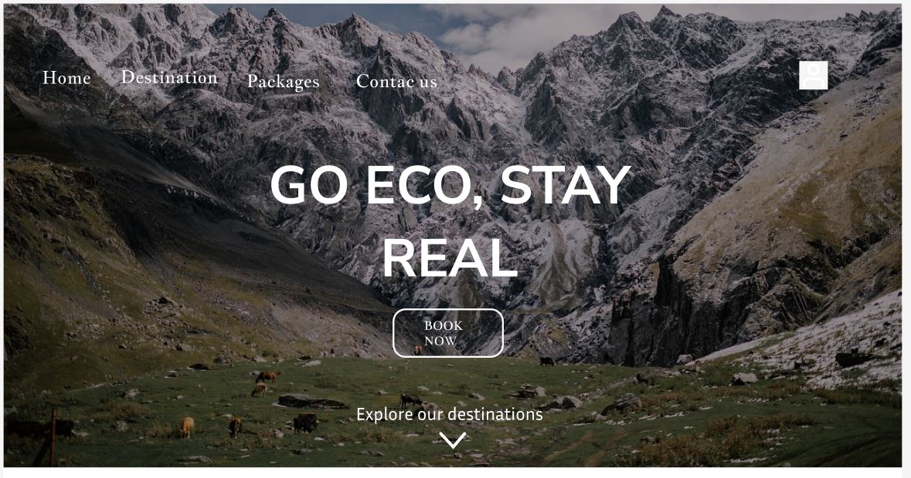

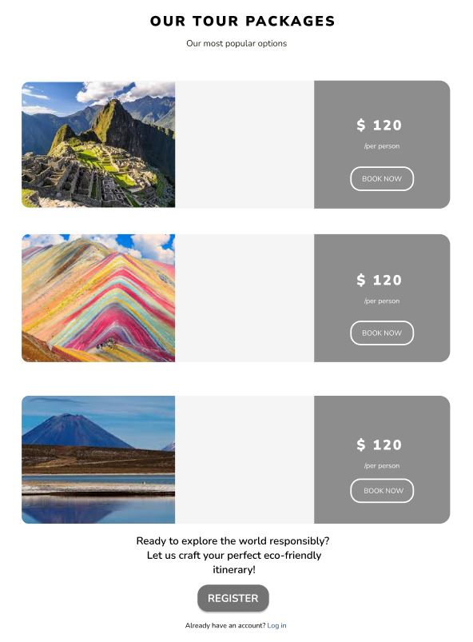
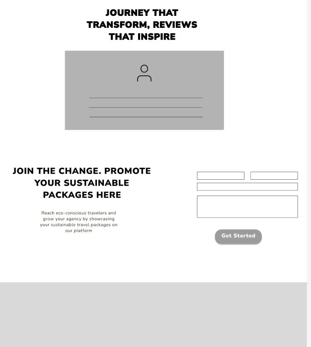

4.3.2. Landing Page Mock-up.

A continuación los Mock ups, estos son los modelos de diseño que se utilizarán en la elaboración del landing page y servirá de modelo y base para la elaboración del programa.

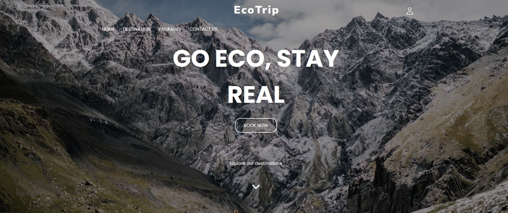

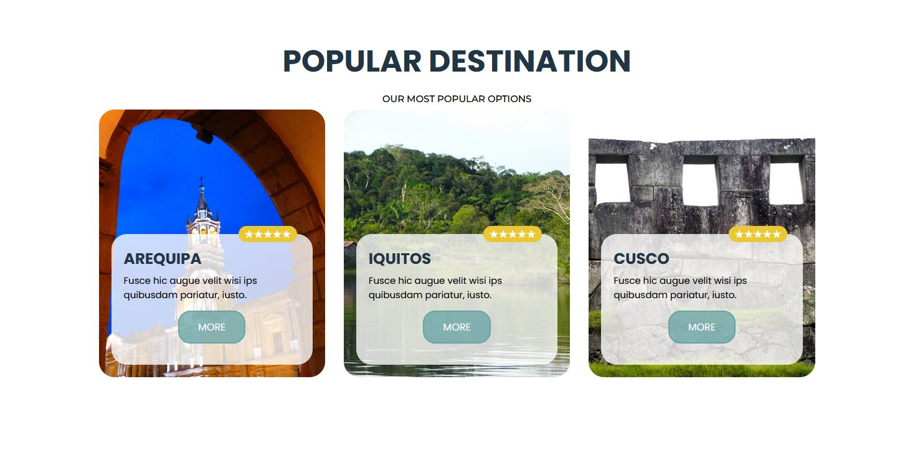
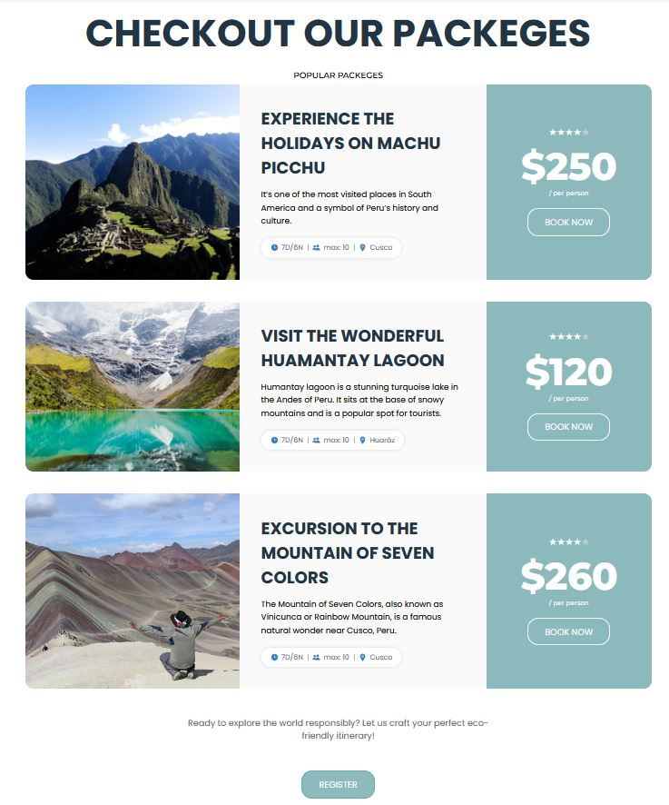
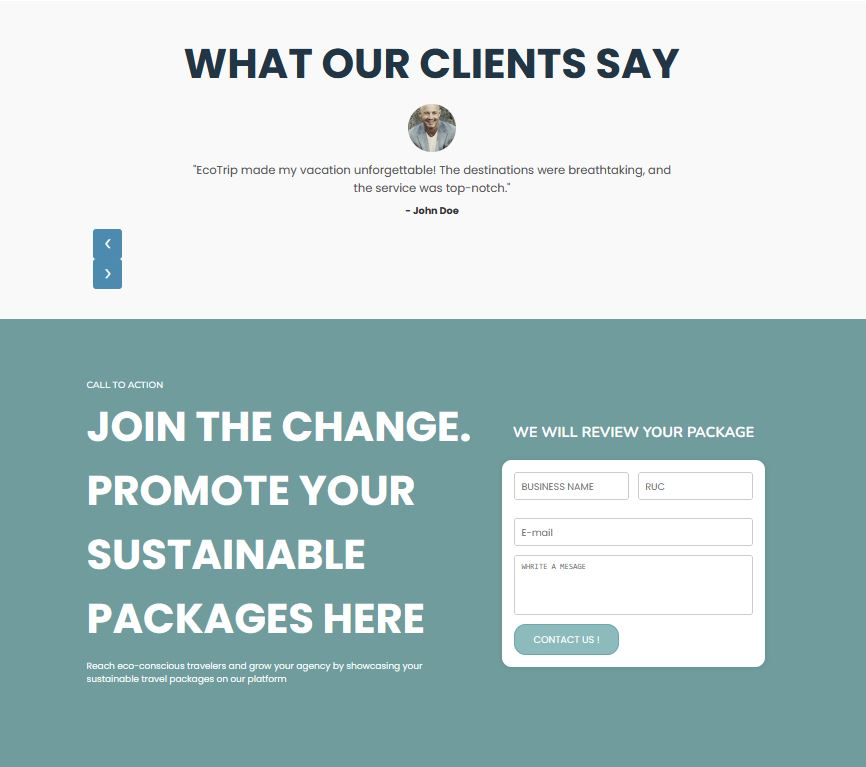
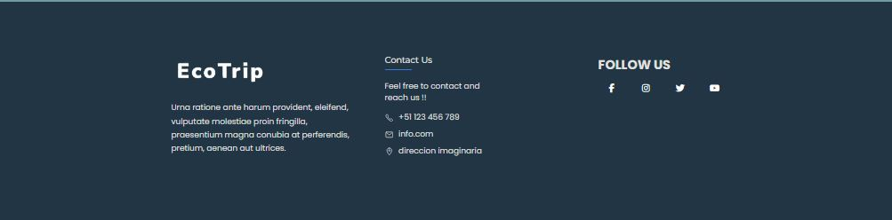

4.4. Web Applications UX/UI Design.

@@ -608,241 +130,241 @@ A continuación los Mock ups, estos son los modelos de diseño que se utilizará

4.6.1. Software Architecture Context Diagram.

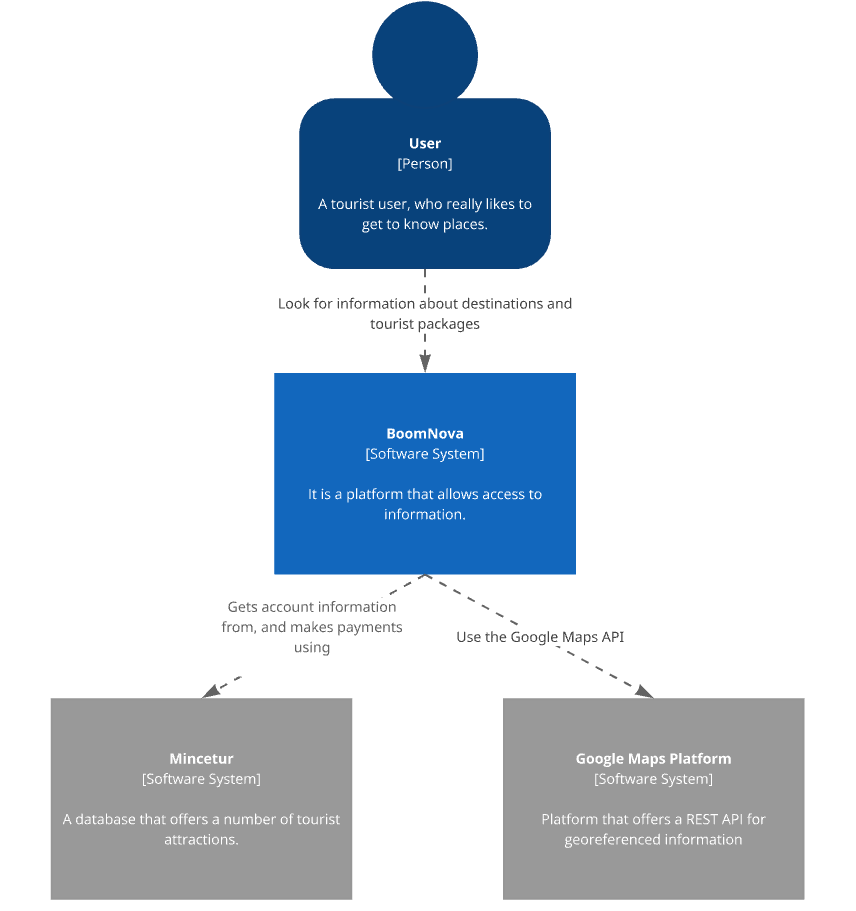

4.6.2. Software Architecture Container Diagrams.

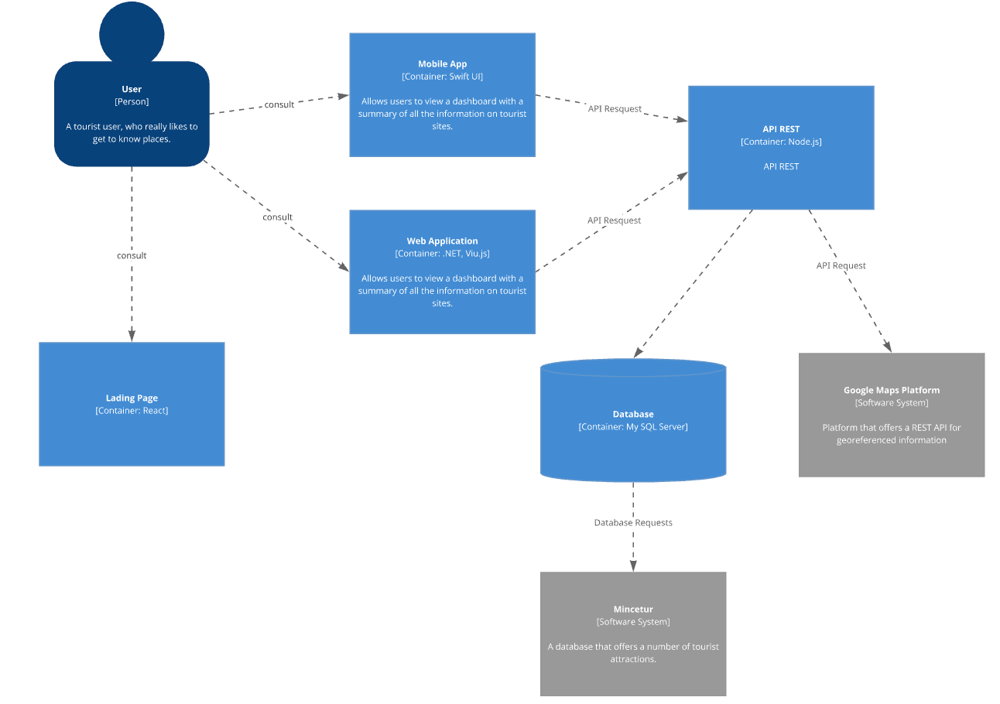

4.6.3. Software Architecture Components Diagrams.

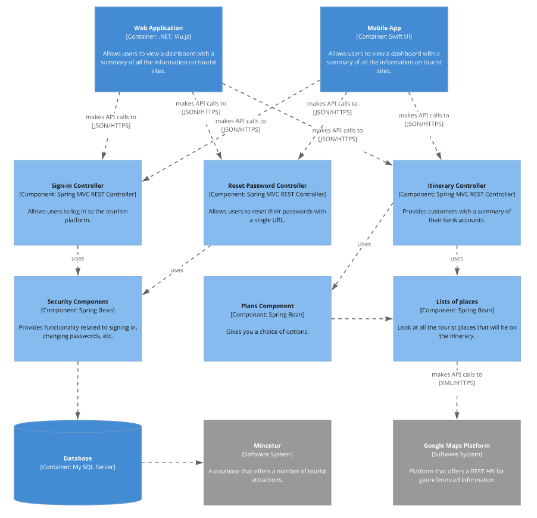

4.7. Software Object-Oriented Design.

4.7.1. Class Diagrams.

Se realizo el diagram de clase

  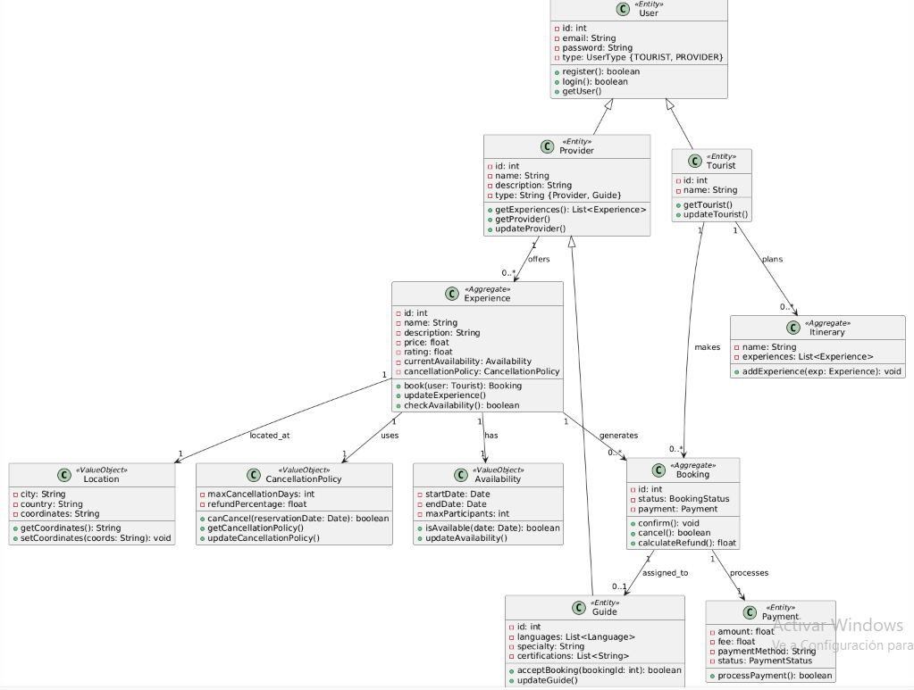

4.7.2. Class Dictionary.

### 1. User Bounded Context

#### User (Aggregate)

La clase **User** contiene los datos de autenticación y los detalles generales de un usuario en la plataforma (ya sea un viajero o proveedor).

#### Atributos:

- `id: int` – Identificador único del usuario.
- `name: String` – Nombre completo del usuario.
- `email: String` – Correo electrónico del usuario, utilizado para el inicio de sesión.
- `password: String` – Contraseña cifrada del usuario.
- `preferredLanguage: String` – Idioma preferido del usuario para personalizar la interfaz.

#### Métodos:

- `register()` – Guarda los datos del usuario en la base de datos al momento de registrarse.
- `login()` – Verifica las credenciales del usuario para autenticarlo.
- `changeLanguage(language: String)` – Permite cambiar el idioma preferido del usuario.

### 2. Provider Bounded Context

#### Provider (Aggregate)

La clase **Provider** representa a un proveedor de servicios, como un eco-alojamiento o un guía turístico.

#### Atributos:

- `id: int` – Identificador único del proveedor.
- `name: String` – Nombre del negocio o servicio del proveedor.
- `type: String` – Tipo de proveedor, como "Lodge" (alojamiento) o "TourGuide" (guía turístico).
- `isVerified: boolean` – Indica si el proveedor ha sido verificado y aprobado por EcoTrip.

#### Métodos:

- `registerProvider()` – Crea un perfil nuevo para un proveedor en el sistema.
- `verify()` – Marca al proveedor como verificado para que pueda ofrecer sus servicios.

### Guide (Entidad, hereda de Provider)

La clase **Guide** representa a un guía turístico certificado.

#### Atributos:

- `languages: List<String>` – Idiomas que habla el guía (por ejemplo, ["Español", "Inglés"]).
- `specialty: String` – Especialidad del guía, como "Fauna" o "Patrimonio Cultural".
- `isAvailable: boolean` – Disponibilidad actual del guía para aceptar nuevas reservas.

#### Métodos:

- `acceptBooking(bookingId: int)` – Confirma la reserva realizada por un usuario.

### 3. Experience Bounded Context

#### Experience (Agregado)

La clase **Experience** representa una actividad de turismo sostenible que puede ser reservada por los usuarios.

#### Atributos:

- `id: int` – Identificador único de la experiencia.
- `name: String` – Nombre de la actividad (por ejemplo, "Caminata por la selva").
- `price: float` – Precio por persona para la experiencia.
- `maxCapacity: int` – Número máximo de participantes permitidos.
- `type: String` – Tipo de experiencia, como "Aventura" o "Cultural".

#### Métodos:

- `book(user: User)` – Crea una nueva reserva para un usuario.
- `updatePrice(newPrice: float)` – Permite actualizar el precio de la experiencia.

#### Location (Objeto de Valor)

La clase **Location** describe los detalles geográficos de una experiencia.

#### Atributos:

- `city: String` – Ciudad más cercana a la experiencia.
- `country: String` – País en el que se realiza la experiencia.
- `coordinates: String` – Coordenadas geográficas (latitud/longitud) del lugar.

#### Métodos:

- `getCoordinates():String` – Devolver las coordenadas

#### Itinerary (Agregado)

La clase **Itinerary** representa el itinerario de un viaje, que incluye una lista de experiencias que el usuario ha planeado realizar.

#### Atributos:

- `id: int` – Identificador único del itinerario.
- `name: String` – Nombre del itinerario (por ejemplo, "Aventura en la Selva").
- `startDate: Date` – Fecha de inicio del itinerario.
- `endDate: Date` – Fecha de finalización del itinerario.
- `budget: float` – Presupuesto total disponible para el itinerario.
- `experiences: List<Experience>` – Lista de experiencias reservadas para este itinerario.

#### Métodos:

- `addExperience(experience: Experience)` – Añade una nueva experiencia al itinerario.
- `removeExperience(experienceId: int)` – Elimina una experiencia del itinerario dado su identificador.
- `generateRecommendations()` – Genera una lista de experiencias recomendadas basadas en el itinerario.
- `calculateTotalCost()` – Calcula el costo total del itinerario, sumando los precios de todas las experiencias asociadas.

### 4. Booking Bounded Context

#### Booking (Agregado)

La clase **Booking** representa una reserva confirmada realizada por un usuario para una experiencia.

#### Atributos:

- `id: int` – Identificador único de la reserva.
- `status: String` – Estado de la reserva, que puede ser "Confirmada" o "Cancelada".
- `totalAmount: float` – Monto total de la reserva, incluyendo cualquier tarifa adicional.

#### Métodos:

- `cancel()` – Aplica la política de cancelación para realizar reembolsos según las reglas establecidas.

#### CancellationPolicy (Objeto de Valor)

La clase **CancellationPolicy** define las reglas para la cancelación de reservas.

#### Atributos:

- `maxCancellationDays: int` – El número máximo de días antes de la fecha de la experiencia para cancelar y obtener un reembolso completo.
- `refundPercentage: float` – Porcentaje de reembolso disponible si la cancelación se realiza después del período permitido.

### 5. Review Bounded Context

#### Review (Entidad)

La clase **Review** permite a los usuarios dejar comentarios y calificaciones sobre una experiencia.

#### Atributos:

- `environmentalScore: int` – Calificación de sostenibilidad de la experiencia (de 1 a 5).
- `culturalScore: int` – Calificación del impacto cultural de la experiencia.
- `comment: String` – Comentario escrito por el usuario sobre la experiencia.

#### Métodos:

- `calculateFinalScore()` – Calcula la calificación final promediando todas las puntuaciones recibidas (sostenibilidad, impacto cultural, etc.).

4.8. Database Design.

  4.8.1. Database Diagram.

  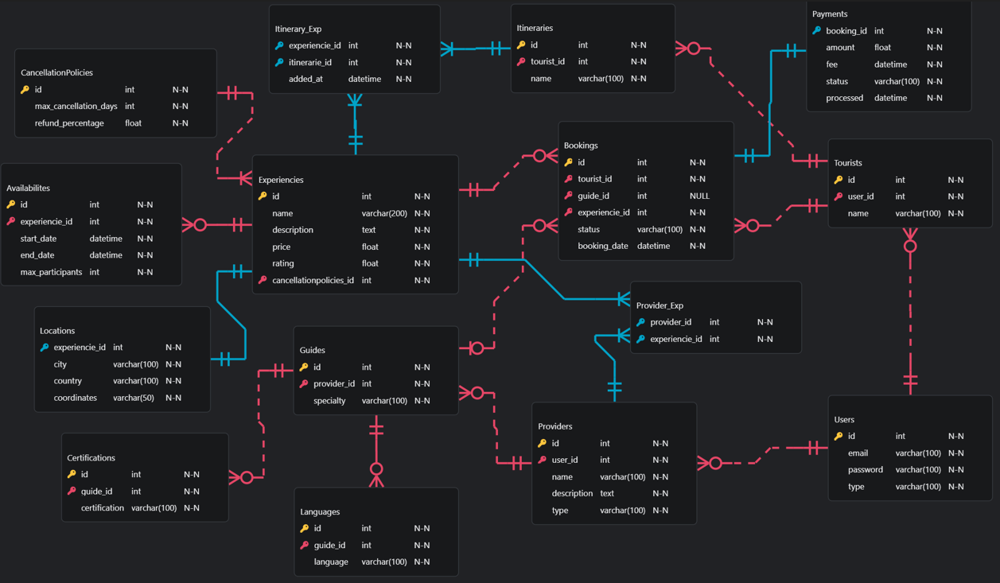

### Capítulo V: Product Implementation, Validation & Deployment

5.2.X.1. Sprint Planning 1.

| **Sprint #**                        | Sprint 1                                                                                                                                                                                                                                                                                                                                                                                                   |
| ----------------------------------- | ---------------------------------------------------------------------------------------------------------------------------------------------------------------------------------------------------------------------------------------------------------------------------------------------------------------------------------------------------------------------------------------------------------- |
| **Sprint Planning Background**      |                                                                                                                                                                                                                                                                                                                                                                                                            |
| **Date**                            | 26 de abril del 2025                                                                                                                                                                                                                                                                                                                                                                                       |
| **Time**                            | 18:00 horas                                                                                                                                                                                                                                                                                                                                                                                                |
| **Location**                        | Modalidad remota a través de la plataforma Google Meet                                                                                                                                                                                                                                                                                                                                                     |
| **Prepared By**                     | Todos los integrantes del equipo EcoTrip                                                                                                                                                                                                                                                                                                                                                                   |
| **Attendees (to planning meeting)** | Todos los integrantes del equipo EcoTrip                                                                                                                                                                                                                                                                                                                                                                   |
| **Sprint 0 Review Summary**         | Dado que es nuestro primer sprint de desarrollo, aún no se ha realizado un resumen del sprint anterior.                                                                                                                                                                                                                                                                                                    |
| **Sprint 0 Retrospective Summary**  | No se identificaron mejoras ya que es el primer sprint.                                                                                                                                                                                                                                                                                                                                                    |
| **Sprint Goal & User Stories**      |                                                                                                                                                                                                                                                                                                                                                                                                            |
| **Sprint 1 Goal**                   | En este sprint, nuestro enfoque está en describir nuestra startup y en construir la estructura de la Landing Page y los sistemas principales de navegación y búsqueda de EcoTrip. Se desarrollarán los primeros módulos visibles, asegurando que la navegación y búsqueda sean funcionales para usuarios frecuentes y ocasionales. El objetivo es facilitar el descubrimiento de experiencias sostenibles. |
| **Sprint 1 Velocity**               | 5                                                                                                                                                                                                                                                                                                                                                                                                          |
| **Sum of Story Points**             | 5                                                                                                                                                                                                                                                                                                                                                                                                          |

5.2.X.2. Aspect Leaders and Collaborators.

| Team Member (Last Name, First Name)  | Github Username | Diseño, wireframes landing Leader (L), Collaborator (C) | Desarrollo estatico HTML, CSS, JS Leader (L), Collaborator (C) | Desplegar el servicio Leader (L), Collaborator (C) | 
| ------------------------------------ | --------------- | ------------------------------------------ | ---------------- | -------------- | 
| Romina Alejanda Tuesta Marin  | Romimi1  | (L) | (L) | (L) | 
| Team Member (Last Name, First Name)  |  |  (C) | (C) | (C) | 
| Team Member (Last Name, First Name)  |  | (C) | (C)| (C) | 
| Team Member (Last Name, First Name)  |  | (C) | (C) | (C) | 
| Team Member (Last Name, First Name)  |  | (C) | (C) | (C) | 

5.4. Video About-the-Product.

### Conclusiones

### Conclusiones y recomendaciones.

### Video About-the-Team.
